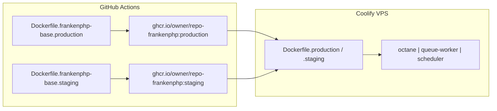

# Coolify — production and staging

This guide describes how to run **Quantyra IDX API** on [Coolify](https://coolify.io/) using the **[Dockerfile build pack](https://coolify.io/docs/builds/packs/dockerfile)**. **FrankenPHP 8.5 + PHP extensions** are pre-built in **GHCR**; Coolify builds the **application layer** (Composer, Vite, Artisan caches) from [`Dockerfile.production`](../Dockerfile.production) or [`Dockerfile.staging`](../Dockerfile.staging) on each deploy.

Use **two Coolify projects** (staging and production), each with its own PostgreSQL database and environment variables.

**Queues:** **`database`** driver (`jobs` table). Deploy **web** (Octane), **worker(s)**, **scheduler**, and **idx-images**. See §2.5 for scaling workers.

**Related:** [README.md](../README.md), [AGENTS.md](../AGENTS.md).

---

## 1. Two-layer images — FrankenPHP base (GHA) + app (Coolify)



| Layer | Built by | Dockerfile | GHCR tag |
|-------|----------|------------|----------|
| **FrankenPHP base (production)** | GHA on push to `main` | [`Dockerfile.frankenphp-base.production`](../Dockerfile.frankenphp-base.production) | `ghcr.io/<owner>/<repo>-frankenphp:production` |
| **FrankenPHP base (staging)** | GHA on push to `staging` | [`Dockerfile.frankenphp-base.staging`](../Dockerfile.frankenphp-base.staging) | `ghcr.io/<owner>/<repo>-frankenphp:staging` |
| **Application** | **Coolify** per deploy | [`Dockerfile.production`](../Dockerfile.production) or [`.staging`](../Dockerfile.staging) | *(local image on the server)* |

Workflow: [`.github/workflows/docker-publish.yml`](../.github/workflows/docker-publish.yml) — **`linux/amd64` only**.

**What the base includes:** `dunglas/frankenphp:php8.5-alpine`, `install-php-extensions` (pgsql, gd, opcache, …), staging **Xdebug**, Composer binary, `/var/cache/geoidx` layout.

**What Coolify still builds:** `COPY` app source, `composer install`, config cache on all targets. **Octane only:** `npm ci` / Vite, `filament:assets`, and (production) `view:cache`. Worker and scheduler targets skip Node/Vite — **not** `install-php-extensions` on every deploy.

### 1.1 Bootstrap GHCR base images

Before the first Coolify app build:

1. Merge or push to **`main`** → publishes `ghcr.io/<owner>/<repo>-frankenphp:production`.
2. Push to **`staging`** → publishes `ghcr.io/<owner>/<repo>-frankenphp:staging`.
3. Or run the workflow manually: **Actions → Docker publish (FrankenPHP base) → Run workflow**.

Add **GHCR registry credentials** on the Coolify server (read access) so `docker build` can `FROM` the base image.

### 1.2 Coolify — Dockerfile build pack (API apps)

| Coolify field | Production | Staging |
|---------------|------------|---------|
| **Build pack** | Dockerfile | Dockerfile |
| **Dockerfile** | `Dockerfile.production` | `Dockerfile.staging` |
| **Docker Build Target** | `octane` (web), `queue-worker`, or `scheduler` per app — see §1.4 | Same |
| **Port (web only)** | **8000** | **8000** |

**Build argument `FRANKENPHP_BASE_IMAGE`** — baked into [`Dockerfile.staging`](../Dockerfile.staging) / [`.production`](../Dockerfile.production). **Important:** if Coolify has `FRANKENPHP_BASE_IMAGE` in environment variables with [inject build args](https://coolify.io/docs/builds/packs/dockerfile#inject-build-args-to-dockerfile) enabled, that value **overrides** the Dockerfile default (see your deploy log: `ARG FRANKENPHP_BASE_IMAGE=ghcr.io/jloescher/geoidx-frankenphp:staging`).

| Environment | Dockerfile default (GHA) | Also published as alias |
|-------------|--------------------------|-------------------------|
| Production | `ghcr.io/jloescher/geo-idx-api-frankenphp:production` | `ghcr.io/jloescher/geoidx-frankenphp:production` |
| Staging | `ghcr.io/jloescher/geo-idx-api-frankenphp:staging` | `ghcr.io/jloescher/geoidx-frankenphp:staging` |

If you set `FRANKENPHP_BASE_IMAGE` in Coolify, it must match a tag that **exists on GHCR** (run the GHA workflow first). To use the Dockerfile default instead, **remove** `FRANKENPHP_BASE_IMAGE` from Coolify env (or mark it build-time only if your Coolify version supports that).

**Before the first app deploy:** run GHA **Docker publish (FrankenPHP base)** on `staging` / `main`, then configure **GHCR read** on the Coolify server.

**Runtime env:** Same `DB_*`, `APP_KEY`, `QUEUE_CONNECTION`, and URLs on web, worker, and scheduler. **Turnstile** keys on **web** only.

Prefer **`APP_ENV` at runtime**, not only at image build time ([Coolify env docs](https://coolify.io/docs/builds/packs/dockerfile#environment-variables)).

### 1.3 Deploy layout — three API applications

**Option A — separate build targets (simplest healthchecks)**

| App | Dockerfile | Build target | Coolify healthcheck |
|-----|------------|--------------|---------------------|
| Web | `Dockerfile.*` | `octane` | HTTP `GET /up` on **8000** |
| Worker | same file | `queue-worker` | Image **pgrep** (or disable HTTP) |
| Scheduler | same file | `scheduler` | Image **pgrep** (or disable HTTP) |

Each deploy rebuilds the app layers from git; the FrankenPHP base is **pulled** from GHCR (fast when unchanged).

**Option B — one web build, shared image for worker/scheduler**

Build **only** target `octane` on the web app. On worker and scheduler Coolify apps, use the **same built image** with **command** overrides (§1.5) and **disable HTTP healthcheck** (octane image probes port 8000).

### 1.4 Canonical Docker build targets

| Target | Build stage | Purpose |
|--------|-------------|---------|
| `octane` | `builder-web` | Web (FrankenPHP / Octane on **8000**); includes Vite + Filament assets |
| `queue-worker` | `builder-cli` | Queue worker (**pgrep** healthcheck); no Vite/Node |
| `scheduler` | `builder-cli` | Scheduler (**pgrep** healthcheck); no Vite/Node |
| `idx-api-worker` / `idx-api-scheduler` | same as above | Aliases of the above |

### 1.5 Command overrides (Option B only)

**Worker — staging:** `/bin/sh -lc 'exec php -d memory_limit=640M artisan queue:work --queue=${WORKER_QUEUES:-default} --sleep=1 --tries=3 --timeout=120'`

**Worker — production:** `/bin/sh -lc 'exec php -d memory_limit=512M artisan queue:work --queue=${WORKER_QUEUES:-default} --sleep=1 --tries=3 --timeout=120'`

**Scheduler — staging:** `php -d memory_limit=384M artisan schedule:work`  
**Scheduler — production:** `php -d memory_limit=256M artisan schedule:work`

### 1.6 idx-images (fourth app)

[`Dockerfile.idx-images`](../Dockerfile.idx-images) on Coolify, port **8080**. Upstream **`idx-api:8000`** on the shared Docker network.

### 1.7 Local / smoke builds

```bash
# 1) Build or pull base
docker buildx build --platform linux/amd64 -f Dockerfile.frankenphp-base.production \
  -t ghcr.io/<owner>/<repo>-frankenphp:production .

# 2) Build app
docker buildx build --platform linux/amd64 -f Dockerfile.production --target octane \
  --build-arg FRANKENPHP_BASE_IMAGE=ghcr.io/<owner>/<repo>-frankenphp:production .
```

---

## 2. Production — four applications

### 2.1 API web (Octane)

| Field | Value |
|-------|--------|
| **Name** | `idx-api` (for `idx-images` upstream) |
| **Dockerfile** | `Dockerfile.production` |
| **Build target** | `octane` |
| **Build arg** | `FRANKENPHP_BASE_IMAGE=ghcr.io/<owner>/<repo>-frankenphp:production` |
| **Port** | **8000** |

### 2.2 API queue worker

| Field | Value |
|-------|--------|
| **Dockerfile** | `Dockerfile.production` |
| **Build target** | `queue-worker` (Option A) or shared `octane` image (Option B) |
| **Healthcheck** | Use image pgrep, or disable HTTP if using Option B |

### 2.3 API scheduler

| Field | Value |
|-------|--------|
| **Dockerfile** | `Dockerfile.production` |
| **Build target** | `scheduler` (Option A) or shared `octane` image (Option B) |

### 2.4 Image edge (Nginx)

`Dockerfile.idx-images`, port **8080**, `GET /health`.

### 2.5 Multiple queue workers

Coolify **replicas** on the worker app, or duplicate worker applications. **One** scheduler only.

---

## 3. Staging

Same as production with **`Dockerfile.staging`**, build arg `FRANKENPHP_BASE_IMAGE=ghcr.io/<owner>/<repo>-frankenphp:staging`, and staging memory limits in the Dockerfile `CMD`.

---

## 4. Environment variables

Copy from **`.env.example`**. Per application for web, workers, and scheduler.

| Variable | Notes |
|----------|--------|
| `FRANKENPHP_BASE_IMAGE` | **Build-time** on Coolify (§1.2) |
| `DB_*`, `APP_KEY`, `QUEUE_CONNECTION` | Runtime, all API apps |
| `CLOUDFLARE_TURNSTILE_*` | Web app only |

---

## 5. Post-deployment (required)

Run migrations **once per environment** before workers can process jobs reliably. Staging/production use `CACHE_STORE=database` and `SESSION_DRIVER=database`, which require the `cache`, `cache_locks`, `sessions`, and `jobs` tables from Laravel’s default migrations.

**On the Octane container** (or any API container with the same `DB_*` env):

```bash
php artisan migrate --force
php artisan optimize
```

Verify:

```bash
php artisan migrate:status | head -20
php artisan crypto:refresh-prices   # optional smoke test (CoinGecko + cache write)
```

In Coolify you can use **Execute command** on the web app after deploy, or a **Post-deployment** hook that runs `php artisan migrate --force`.

---

## 6. Route cache

Omit `route:cache` at image build when multiple `IDX_PLATFORM_HOSTS` share route names. Post-deploy `route:cache` only for single-host setups.

---

## 7. CPU and memory

See [AGENTS.md](../AGENTS.md). Container RAM > PHP `memory_limit` + ~300 MB on web.

---

## 8. Coolify checklist

1. Publish both FrankenPHP bases via GHA (§1.1).
2. GHCR read credentials on Coolify.
3. Three API apps: Dockerfile pack + `FRANKENPHP_BASE_IMAGE` + correct target (§1.3).
4. idx-images on **8080**, network alias **`idx-api`**.
5. Shared runtime env; deploy; **run `php artisan migrate --force` (§5)** on first deploy and after new migrations.
6. Redeploy worker/scheduler after migrations if they crashed on missing tables.

---

## 9. Troubleshooting

### `relation "cache" does not exist` (workers / queue)

`CACHE_STORE=database` (default in `.env.example`) stores Laravel cache and queue restart signals in PostgreSQL. The **`cache`** and **`cache_locks`** tables come from `database/migrations/0001_01_01_000001_create_cache_table.php`.

**Fix:** run migrations on the staging/production database (§5):

```bash
php artisan migrate --force
```

Then restart workers (`queue:restart` happens automatically on next deploy, or redeploy the worker app). `RefreshCryptoPricingJob` also writes to this cache store.

Related: `SESSION_DRIVER=database` needs the **`sessions`** table (`0001_01_01_000000_create_users_table.php`); `QUEUE_CONNECTION=database` needs **`jobs`** (`0001_01_01_000002_create_jobs_table.php`).

### `base name (${FRANKENPHP_BASE_IMAGE}) should not be blank`

Coolify did not pass **`FRANKENPHP_BASE_IMAGE`** and the Dockerfile had no default. Use current `Dockerfile.staging` / `.production` (they include defaults), or set env **`FRANKENPHP_BASE_IMAGE`** in Coolify with inject build args enabled.

### `ghcr.io/jloescher/geoidx-frankenphp:staging: not found`

Coolify injected `FRANKENPHP_BASE_IMAGE=ghcr.io/jloescher/geoidx-frankenphp:staging` from your app env, which overrides the Dockerfile default. That tag only exists after GHA publishes the **alias** (see workflow). **Fix:** run **Docker publish (FrankenPHP base)** on `staging`, **or** delete `FRANKENPHP_BASE_IMAGE` from Coolify env, **or** set it to `ghcr.io/jloescher/geo-idx-api-frankenphp:staging`.

### `failed to resolve FRANKENPHP_BASE_IMAGE` / `pull access denied`

Run GHA **Docker publish (FrankenPHP base)** first. Add **GHCR read** credentials on the Coolify server.

### `map has no entry for key "Health"`

Use build targets **`queue-worker`** / **`scheduler`** (Option A), or disable HTTP healthcheck when reusing the **`octane`** image (Option B).

### Deploy still runs `install-php-extensions` for a long time

Coolify is not using the GHCR base — check `FROM ${FRANKENPHP_BASE_IMAGE}` and the build arg.

### Octane: Caddy storage / autosave warnings

Non-fatal FrankenPHP/Caddy noise; **`/up`** on **8000** should still pass.

**Octane deploy log: one failed `curl` then healthy** — normal while Octane binds port 8000 during the healthcheck start period; rolling update should still complete.

### `ViteManifestNotFoundException`

Vite stage failed during Coolify build — check Node stage logs.

### ARM on amd64 VPS

Use GHA **`linux/amd64`** bases and `docker buildx --platform linux/amd64` locally.

---

## 10. References

- [Dockerfile build pack](https://coolify.io/docs/builds/packs/dockerfile)
- [Build arguments](https://coolify.io/docs/builds/packs/dockerfile#build-arguments)
- [Pre / post deployment commands](https://coolify.io/docs/builds/packs/dockerfile#pre-post-deployment-commands)
