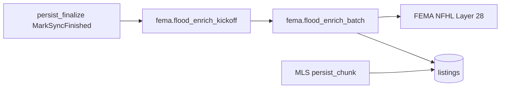

# FEMA NFHL flood zone enrichment

idx-api enriches mirrored `listings` with FEMA National Flood Hazard Layer (NFHL) **Layer 28** point queries. MLS replication continues to populate `flood_zone_code` from RESO; FEMA attributes live in separate columns.

## Column semantics

| Column | Source |
|--------|--------|
| `flood_zone_code` | MLS at persist (unchanged) |
| `fema_flood_zone_code` | FEMA `FLD_ZONE` |
| `flood_zone_sfha_tf` | FEMA `SFHA_TF` |
| `flood_zone_raw` | Full ArcGIS feature attributes (JSON) |
| `flood_zone_updated_at` | Last NFHL point query (including no-match) |
| `low_risk_flood_zone_yn` | **`ComputeLowRiskFloodZoneYN(fema_flood_zone_code)` only** — not MLS |

MLS persist sets `low_risk_flood_zone_yn = false` on insert and does **not** overwrite it on `ON CONFLICT` update. FEMA batch jobs recompute the flag from `fema_flood_zone_code`.

Display/API helpers may use `EffectiveFloodZoneCode(mls, fema, femaAt)` for a single label (FEMA when enriched, else MLS). Search `low_risk_floodzone` filters `low_risk_flood_zone_yn = TRUE` on the stored column.

## Architecture



- **Queue:** PostgreSQL `jobs` table (`fema.flood_enrich_kickoff`, `fema.flood_enrich_batch`)
- **Trigger:** After replication `MarkSyncFinished`, plus daily scheduler cron (`0 30 4 * * *`)
- **Batch size:** `FEMA_FLOOD_ENRICH_BATCH_SIZE` (default 2000), self-chaining via `cursor_id`

## Environment variables

| Variable | Default | Description |
|----------|---------|-------------|
| `FEMA_NFHL_BASE_URL` | FEMA MapServer URL | NFHL public MapServer |
| `FEMA_NFHL_LAYER_ID` | `28` | Flood hazard zone layer |
| `FEMA_FLOOD_ENRICH_BATCH_SIZE` | `2000` | Listings per batch job |
| `FEMA_FLOOD_STALE_DAYS` | `30` | Re-query interval |
| `FEMA_MAX_REQUESTS_PER_SECOND` | `8` | Outbound rate limit |
| `FEMA_HTTP_TIMEOUT` | `15s` | HTTP client timeout |
| `FEMA_USER_AGENT` | Quantyra UA | Required by FEMA |
| `FEMA_ENRICH_QUEUE` | `default` | Worker queue name |
| `FEMA_CIRCUIT_FAIL_THRESHOLD` | `5` | Consecutive failures before circuit open |

Include `FEMA_ENRICH_QUEUE` in `WORKER_QUEUES` on the worker process.

## Operations

**Manual kickoff (session auth):**

```http
POST /api/v1/admin/flood-enrich
Content-Type: application/json

{"dataset_slug": "stellar", "limit": 100}
```

- Empty body or no `limit`: enqueues `fema.flood_enrich_kickoff` (deduped if a fema enrich job is already pending).
- `limit`: enqueues a single `fema.flood_enrich_batch` for staging smoke tests.

**Verification SQL:**

```sql
SELECT COUNT(*) FILTER (WHERE flood_zone_updated_at IS NOT NULL),
       COUNT(*) FILTER (WHERE fema_flood_zone_code IS NOT NULL)
FROM listings WHERE latitude IS NOT NULL;
```

**Metrics:** Prometheus on `/metrics` — `fema_nfhl_requests_total`, `fema_enrich_listings_updated_total`, `fema_circuit_breaker_open`, etc.

## Compliance

- Non-MLS augmentation; geo-web and clients must not call FEMA NFHL directly.
- Use idx-api search/GIS surfaces that read mirrored `listings` columns.

## Fresh database

Schema columns are in `migrations/00001_initial.sql`. New environments: `make migrate` on an empty database per [database-migrations.md](database-migrations.md).
