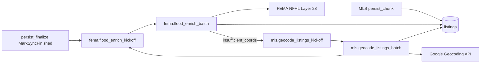

# FEMA NFHL flood zone enrichment

idx-api enriches mirrored `listings` with FEMA National Flood Hazard Layer (NFHL) **Layer 28** point queries. MLS replication continues to populate `flood_zone_code` from RESO; FEMA attributes live in separate columns.

## Column semantics

| Column | Source |
|--------|--------|
| `flood_zone_code` | MLS at persist (unchanged) |
| `fema_flood_zone_code` | FEMA `FLD_ZONE` |
| `flood_zone_sfha_tf` | FEMA `SFHA_TF` |
| `flood_zone_raw` | Full ArcGIS feature attributes (JSON) |
| `flood_zone_updated_at` | Last NFHL point query (including no-match) |
| `fema_attempted_at` | Last enrichment attempt (any outcome) |
| `fema_failure_reason` | `no_nfhl_feature`, `request_error`, or `insufficient_coords` (NULL on success) |
| `fema_failed_at` | Set on `request_error`; cleared on success |
| `fema_attempt_count` | Incremented on every attempt |
| `low_risk_flood_zone_yn` | **`ComputeLowRiskFloodZoneYN(fema_flood_zone_code)` only** — not MLS |

MLS persist sets `low_risk_flood_zone_yn = false` on insert and does **not** overwrite it on `ON CONFLICT` update. FEMA batch jobs recompute the flag from `fema_flood_zone_code`.

Display/API helpers may use `EffectiveFloodZoneCode(mls, fema, femaAt)` for a single label (FEMA when enriched, else MLS). Search `low_risk_floodzone` filters `low_risk_flood_zone_yn = TRUE` on the stored column.

## Architecture



- **Queue:** PostgreSQL `jobs` table (`fema.flood_enrich_kickoff`, `fema.flood_enrich_batch`)
- **Trigger:** After replication `MarkSyncFinished`, plus daily scheduler cron (`0 30 4 * * *`)
- **Batch size:** `FEMA_FLOOD_ENRICH_BATCH_SIZE` (default 2000), self-chaining via `cursor_id`

## Environment variables

| Variable | Default | Description |
|----------|---------|-------------|
| `FEMA_NFHL_BASE_URL` | FEMA MapServer URL | NFHL public MapServer |
| `FEMA_NFHL_LAYER_ID` | `28` | Flood hazard zone layer |
| `FEMA_FLOOD_ENRICH_BATCH_SIZE` | `2000` | Listings per batch job |
| `FEMA_FLOOD_STALE_DAYS` | `30` | Re-query interval |
| `FEMA_MAX_REQUESTS_PER_SECOND` | `8` | Outbound rate limit |
| `FEMA_HTTP_TIMEOUT` | `15s` | HTTP client timeout |
| `FEMA_USER_AGENT` | Quantyra UA | Required by FEMA |
| `FEMA_ENRICH_QUEUE` | `default` | Worker queue name |
| `FEMA_CIRCUIT_FAIL_THRESHOLD` | `5` | Consecutive failures before circuit open |

Include `FEMA_ENRICH_QUEUE` in `WORKER_QUEUES` on the worker that consumes the **`default`** queue (production: **worker 1** in the split topology — [coolify-env-by-app.md](coolify-env-by-app.md)).

## Operations

**Manual kickoff (session auth):**

```http
POST /api/v1/admin/flood-enrich
Content-Type: application/json

{"dataset_slug": "stellar", "limit": 100}
```

- Empty body or no `limit`: enqueues `fema.flood_enrich_kickoff` (deduped if a fema enrich job is already pending).
- `limit`: enqueues a single `fema.flood_enrich_batch` for staging smoke tests.

**Verification SQL:**

```sql
SELECT COUNT(*) FILTER (WHERE flood_zone_updated_at IS NOT NULL) AS fema_attempted,
       COUNT(*) FILTER (WHERE fema_flood_zone_code IS NOT NULL) AS with_fema_code
FROM listings WHERE latitude IS NOT NULL AND longitude IS NOT NULL;
```

### Interpreting missing `fema_flood_zone_code`

A NULL `fema_flood_zone_code` does **not** always mean enrichment failed. Use `flood_zone_updated_at` and coordinates:

```sql
SELECT
  CASE
    WHEN latitude IS NULL OR longitude IS NULL THEN 'no_coords'
    WHEN flood_zone_updated_at IS NULL THEN 'never_attempted'
    WHEN fema_flood_zone_code IS NULL AND flood_zone_updated_at IS NOT NULL THEN 'nfhl_no_zone_at_point'
    ELSE 'has_fema_code'
  END AS bucket,
  COUNT(*) AS n
FROM listings
WHERE fema_flood_zone_code IS NULL
GROUP BY 1
ORDER BY n DESC;
```

| Bucket | Meaning | Action |
|--------|---------|--------|
| `no_coords` | No lat/lng for NFHL point query | Run [geocode backfill](listings-mirror.md) (`mls.geocode_listings_*`) first |
| `never_attempted` | Valid coords but `flood_zone_updated_at` NULL | Confirm `FEMA_*` on default worker; kickoff via cron or `POST /api/v1/admin/flood-enrich` |
| `nfhl_no_zone_at_point` | FEMA queried; no Layer 28 intersect (or empty `FLD_ZONE`) | Expected outside mapped flood polygons; MLS `flood_zone_code` may still be set — use `EffectiveFloodZoneCode` in API |

Listings with coordinates outside WGS-84 ranges are **skipped** by `SelectStaleForEnrichment` until coords are corrected.

### Outcome semantics (migration `00011`)

| Outcome | `fema_failure_reason` | `flood_zone_updated_at` | Retry |
|---------|----------------------|-------------------------|-------|
| NFHL success with zone | NULL | set | — |
| NFHL success, no feature at point | `no_nfhl_feature` | set (staleness watermark) | After `FEMA_FLOOD_STALE_DAYS` |
| HTTP/circuit/timeout error | `request_error` | **NULL** (stays in stale queue) | Next batch / kickoff |
| Missing coordinates | `insufficient_coords` | unchanged | After geocode |
| Bad coordinates on first NFHL miss | `insufficient_coords` | **NULL** (stays in stale queue) | Geocode recovery, then FEMA re-run |

**Worker logs:** `fema flood enrich batch` with `processed` vs `updated`; `fema point query failed` on NFHL errors (rows get `request_error`, not `flood_zone_updated_at`).

## Coordinate recovery (suspicious coords)

When a listing's **first** FEMA pass (`flood_zone_updated_at IS NULL`) returns no NFHL feature **and** coordinates are implausible, the batch marks `fema_failure_reason = insufficient_coords` **without** setting `flood_zone_updated_at`. This avoids the 30-day stale lock on bad MLS pins (Antarctica, Null Island, swapped lat/lng, outside Florida service area).

Suspicious rules (`internal/service/mls/coords_suspicious.go`):

| Rule | Condition |
|------|-----------|
| Antarctica | `lat < -60` |
| Null Island | `lat = 0` and `lng = 0` |
| Outside FL service area | `state = FL` and coords outside lat 24.5–31.2, lng -87.8–-79.8 |
| Likely swapped lat/lng | `state = FL` and `abs(lat) > 50` and `abs(lng) < 45` |

Recovery flow:

1. FEMA batch marks `insufficient_coords` and enqueues geocode kickoff (deduped).
2. Geocode batch selects rows with `fema_failure_reason = insufficient_coords` (even when lat/lng are present), geocodes from address, overwrites coords, clears FEMA watermark.
3. Geocode batch enqueues FEMA kickoff for re-enrichment at corrected coordinates.

Legitimate first-pass `no_nfhl_feature` rows (valid FL coords, no NFHL polygon) are unchanged.

**Existing bad rows:** Use [scripts/fema_insufficient_coords_backfill.sql](scripts/fema_insufficient_coords_backfill.sql) to reset legacy `no_nfhl_feature` rows with suspicious coords, then run admin geocode + flood-enrich kickoffs.

### Staging verification

1. Seed a listing with `lat = -82`, `lng = 27`, FL address, `flood_zone_updated_at IS NULL`.
2. Run FEMA batch → expect `fema_failure_reason = insufficient_coords`, `flood_zone_updated_at` still NULL.
3. Run geocode batch → coords updated from address, FEMA fields cleared.
4. Run FEMA batch again → expect NFHL hit or legitimate `no_nfhl_feature` at corrected point.

```sql
SELECT id, latitude, longitude, state_or_province, fema_failure_reason, flood_zone_updated_at
FROM listings
WHERE fema_failure_reason IN ('no_nfhl_feature', 'insufficient_coords')
  AND latitude < -60
LIMIT 20;
```

**Dashboard:** Data Quality tab shows FEMA stale/null-with-coords counts, per-reason breakdown, sample rows, and **Run FEMA enrich** (`POST /api/v1/admin/flood-enrich`).

**Metrics:** Prometheus on `/metrics` — `fema_nfhl_requests_total`, `fema_enrich_listings_updated_total`, `fema_circuit_breaker_open`, etc.

## Compliance

- Non-MLS augmentation; geo-web and clients must not call FEMA NFHL directly.
- Use idx-api search/GIS surfaces that read mirrored `listings` columns.

## Fresh database

Schema columns are in `migrations/00001_initial.sql`; audit columns in `migrations/00011_fema_enrichment_audit.sql`. New environments: `make migrate` on an empty database per [database-migrations.md](database-migrations.md).
