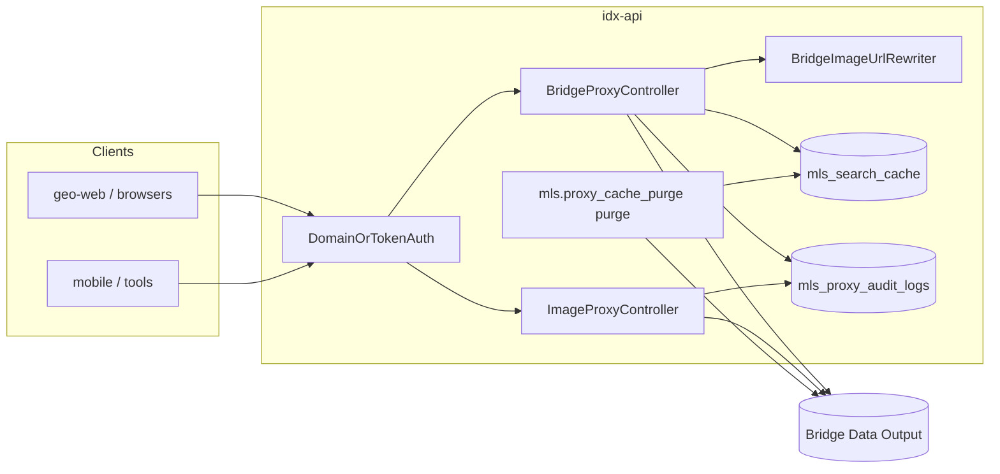

# IDX-API — Secured MLS proxy (Bridge + Spark)

This document describes the **Quantyra idx-api** integration that proxies [Bridge Data Output](https://bridgedataoutput.com) and the [Spark Platform](https://sparkapi.com/) (BeachesMLS) for multiple **MLS feeds**, adds **domain / token authentication**, **listings and search caching**, **full JSON payloads** for authenticated internal traffic, **MLS audit logging**, **automatic rewriting of image URLs in JSON** (including CloudFront and Spark CDN origins) to the public **idx-images** host, **OData cursor pagination support**, and a secured **`/images/...`** binary proxy.

> **Implementation (Go):** `internal/handler/bridge`, `internal/handler/images`, `internal/handler/gis`, `internal/api/middleware/domain_token.go`, `internal/service/sync`, `internal/queue`. Routes: `internal/api/routes.go`. See [go-cutover.md](go-cutover.md).

**Upstream references:**

- Bridge (Stellar, etc.): [bridge-api-documentation.md](bridge-api-documentation.md)
- Spark (BeachesMLS): [spark/README.md](spark/README.md)

**Production base URL** (typical): `https://idx-api.quantyralabs.cc` — or your `APP_URL` / `IDX_API_PUBLIC_URL`.

---

## Goals

| Goal | How it is met |
|------|----------------|
| Single MLS egress | Bridge and Spark credentials stay server-side (`BRIDGE_API_KEY`, `SPARK_ACCESS_TOKEN`). |
| Multi-feed MLS control | Requests identify an **active** row in `domains` (via header, **`?domain=`** query, or `Referer` host) **or** present a valid **personal access token (PAT)** with IDX abilities. Feed access is validated against `domains.allowed_mls_datasets` (catalog keys like `bridge_stellar`, `spark_beaches`). |
| Cost & latency control | **On-demand** live proxy cache in **`mls_search_cache`**: first identical upstream request (method + path + sorted query + POST body fingerprint) is stored gzip-compressed for **`LISTINGS_CACHE_TTL`** (default 15 min); repeats return **`X-IDX-Cache: HIT`**. Lookup routes use **`MLS_LOOKUP_CACHE_TTL`** (~30 days). **Active/Pending** inventory is served from the **PostGIS mirror** (`listings` table + sync jobs), not a pre-warmed `listings_cache` collection. Scheduler job **`mls.proxy_cache_purge`** only **purges** expired cache rows. |
| Hybrid map performance | `POST /api/v1/search`: Active/Pending from PostGIS replica; Closed from live upstream (Bridge or Spark per `?dataset=`); mixed status filters merge both (see **Hybrid search** under Caching & jobs). |
| Pricing enrichment | Listing responses include top-level `pricing` quotes and per-listing `pricing_converted` data sourced from local cache/DB snapshots refreshed asynchronously by queue job. |
| Access model | **Internal-only:** active, MLS-approved **domains** and **personal access token (PAT)s** (with `idx:access` or `idx:full`, plus domain binding for PATs) receive full Bridge-shaped responses. There is **no** Stripe/Cashier subscription tier or plan-based response shrinking in this deployment. |
| Auditability | Every proxied JSON request and image hit writes a row to **`mls_proxy_audit_logs`**. |
| Image CDN pattern | JSON responses rewrite Bridge **`…/listings/{key}/photos/{id}…`** and CloudFront URLs to **`{IDX_IMAGES_PUBLIC_URL}/images/{listingKey}/{photoId}`**; environment-specific normalization ensures consistent URLs across dev/staging/prod; binary **`GET /images/...`** is streamed from Bridge with **long-lived immutable** cache headers for Cloudflare edge caching (see [Image proxy](#image-proxy) and [JSON image URL rewriting](#json-image-url-rewriting)). |

---

## Architecture (high level)



1. Client calls **`/api/v1/...`** or **`/images/...`** with domain identification or Bearer token.
2. **`DomainOrTokenAuth`** (`middleware` alias **`domain.token`**) allows the request or returns **401 / 403**.
3. **`BridgeProxyController`** builds the Bridge URL (Web API, RESO, or doc paths), forwards safe client headers and query string (internal param **`domain`** is **never** sent to Bridge), attaches **Bearer `BRIDGE_API_KEY`** to Bridge.
4. For live proxy routes, **`ProxyCache`** (`internal/service/cache`) may return gzip-stored JSON from **`mls_search_cache`** when the request **fingerprint** matches a row younger than TTL; otherwise Bridge/Spark is called, images are rewritten, and the response is stored (**`X-IDX-Cache: MISS`**).
5. **`BridgeImageUrlRewriter`** rewrites listing photo URLs in successful JSON bodies to **`IDX_IMAGES_PUBLIC_URL`** (see below).
6. **`MlsProxyAuditLogger`** persists audit metadata.

---

## Authentication & authorization

Middleware: **`App\Http\Middleware\DomainOrTokenAuth`**, registered as **`domain.token`** in `idx-api/bootstrap/app.php`.

### Option A — Registered domain

| Source | Rule |
|--------|------|
| `X-Domain-Slug` | Non-empty value is matched **case-insensitively** to `domains.domain_slug` (store full hostnames, e.g. `searchtampabayhouses.com`). |
| `GET ?domain=` | Same lookup as header when `X-Domain-Slug` is absent (useful for server clients that cannot set custom headers). **Not** forwarded to Bridge. |
| `Referer` | If neither header nor `domain` query is set, the **host** portion of `Referer` is used the same way. |

The domain must exist and **`is_active = true`**. Domain-authenticated callers receive the same full outbound MLS JSON as PAT traffic; `DomainOrTokenAuth` treats them as **full access** for proxy purposes.

### Option B — personal access token (PAT)

| Header | Rule |
|--------|------|
| `Authorization: Bearer <token>` | Token must resolve via `PersonalAccessToken::findToken` and have **`idx:access`** and/or **`idx:full`**. |

| Ability | Effect |
|---------|--------|
| `idx:access` | Access allowed (legacy ability name; same full proxy behavior as `idx:full` once authenticated). |
| `idx:full` | Access allowed; typical for dashboard PATs and `POST /api/auth/token`. |

Invalid or ability-missing tokens → **403**.

### Dashboard API keys

The **GeoIDX dashboard** (`/dashboard`) presents a unified Setup flow for new users:

1. **Add your site** — register a domain hostname and select MLS feeds in one step
2. **Verify ownership** — publish a DNS TXT record; the dashboard polls and shows verification status
3. **Connect your app** — a **Production** API key is auto-generated on first successful domain verification and shown once for copying

**Key behavior:**

- On first TXT verification, a **Production** token (`name: Production`, ability: `idx:full`) is created automatically and flashed to the session for one-time display
- A **Staging** token (`name: Staging`, ability: `idx:full`) can be generated from the Setup panel or via `POST /dashboard/api-tokens/staging`; only one Staging token per user (rejects duplicates)
- Additional named tokens can be created from the **API Keys** panel (`/dashboard?panel=api`) via the Livewire `ApiTokenManager` component
- All tokens use ability **`idx:full`**
- Every **`Authorization: Bearer …`** call to **`/api/v1/*`** must also send **`X-Domain-Slug`** or **`?domain=`** for a **TXT-verified** domain on the same account (same binding rules as `DomainOrTokenAuth`)

| Token source | Abilities | Bridge / GIS behavior |
|--------------|-----------|------------------------|
| **Auto-issued Production** (first domain verify) | `idx:full` | Full Bridge / GIS JSON for authenticated requests. |
| **Staging** (one-click from Setup or `POST /dashboard/api-tokens/staging`) | `idx:full` | Same as Production — use for staging/preview frontends with the same domain slug. |
| **Custom named** (`POST /dashboard/api-tokens` or API Keys panel) | `idx:full` | Full Bridge / GIS JSON for authenticated requests. |
| **`POST /api/auth/token`** | `idx:full` | Same as dashboard PATs when used with domain identification (machine clients / scripts). |
| **Geo-web internal** | `idx:full` | Issue a named PAT from `/dashboard` (or seed); pair with **`IDX_API_INTERNAL_TOKEN`** and a verified domain slug on requests. |

After generation, the dashboard shows the raw token **once**; store it securely. Revocation: **API Keys** panel (`/dashboard?panel=api`) or `DELETE /dashboard/api-tokens/{token}`.

---

### Response shaping (authenticated)

- **`mls_search_cache`** stores gzip-compressed upstream JSON keyed by request fingerprint (on-demand; not a full Active/Pending pre-warm). The legacy **`listings_cache`** table is unused by the Go service; mirror data lives in **`listings`**.
- **`BridgeImageUrlRewriter`** runs on successful JSON so photo URLs resolve through **`idx-images`** for CDN and MLS compliance.

---

## JSON image URL rewriting

Service: **`App\Services\Bridge\BridgeImageUrlRewriter`** (used by **`BridgeProxyController`** on successful JSON).

| Behavior | Detail |
|----------|--------|
| **Target URLs** | HTTPS URLs on configured Bridge hosts whose path contains **`/listings/{ListingKey}/photos/{PhotoId}`** (lazy match between host and `/listings/`). |
| **CloudFront URLs** | URLs from CloudFront (`*.cloudfront.net`) are also rewritten to `idx-images` format. |
| **Environment normalization** | Any URL already pointing to an `idx-images` host is normalized to the current environment's `IDX_IMAGES_PUBLIC_URL`. This ensures URLs from cached responses (potentially from different environments) resolve correctly. |
| **Output shape** | `{IDX_IMAGES_PUBLIC_URL}/images/{listingKey}/{photoId}` with path segments **URL-encoded** as needed. Default public base: **`https://idx-images.quantyralabs.cc`**. |
| **`Media[]` objects** | When **`MediaURL`** (and similar keys) appear under a parent with **`ListingKey`**, URLs are rewritten; if the URL is Bridge-hosted but not path-parseable, **`Order`** / **`MediaKey`** / **`Id`** may be used with the parent listing key. |
| **Extra hosts** | Optional comma-separated **`BRIDGE_IMAGE_REWRITE_HOSTS`** extends which hostnames are treated as rewritable Bridge image origins (beyond `bridgedataoutput.com`, `api.bridgedataoutput.com`, and the host of **`BRIDGE_HOST`**). |

Non-JSON or malformed JSON responses are passed through unchanged.

---

## HTTP routes

### JSON API (`/api/...`)

Laravel’s `routes/api.php` is prefixed with **`/api`**. All routes below use middleware **`domain.token`**.

#### Bridge Web API (dataset segment from `BRIDGE_DATASET`, default `stellar`)

| Method | Path | Upstream shape (see Bridge doc) |
|--------|------|----------------------------------|
| GET | `/api/v1/listings` | `/{dataset}/listings` |
| GET | `/api/v1/listings/{listingId}` | `/{dataset}/listings/{listingId}` |
| GET | `/api/v1/agents` | `/{dataset}/agents` |
| GET | `/api/v1/agents/{agentId}` | `/{dataset}/agents/{agentId}` |
| GET | `/api/v1/offices` | `/{dataset}/offices` |
| GET | `/api/v1/offices/{officeId}` | `/{dataset}/offices/{officeId}` |
| GET | `/api/v1/openhouses` | `/{dataset}/openhouses` |
| GET | `/api/v1/openhouses/{openhouseId}` | `/{dataset}/openhouses/{openhouseId}` |

#### RESO-style resources

Built from `BRIDGE_HOST`, optional `BRIDGE_PATH_PREFIX`, `BRIDGE_DATASET`, and optional `BRIDGE_RESO_ROOT` (see [Environment variables](#environment-variables)).

| Method | Path | Resource | Notes |
|--------|------|----------|-------|
| GET, POST | `/api/v1/properties` | `Property` collection | POST accepts JSON body with `city`, `limit`, `cursor`, etc. Query params auto-translated to OData `$filter`, `$top`. |
| GET | `/api/v1/properties/{listingKey}` | `Property` by key | |
| GET | `/api/v1/members` | `Member` collection | |
| GET | `/api/v1/members/{memberKey}` | `Member` by key | |
| GET | `/api/v1/reso-offices` | `Office` collection | |
| GET | `/api/v1/reso-offices/{officeKey}` | `Office` by key | |
| GET | `/api/v1/reso-openhouses` | `OpenHouse` collection | |
| GET | `/api/v1/reso-openhouses/{openHouseKey}` | `OpenHouse` by key | |
| GET | `/api/v1/lookup` | `Lookup` collection | 30-day gzip cache per dataset + query fingerprint (`MLS_LOOKUP_CACHE_TTL`); purge stale rows via the proxy-cache purge job or `DELETE` from `mls_search_cache` by partition. |
| POST | `/api/v1/search` | Structured search | Accepts `SearchRequest` JSON; translates to Bridge RESO OData with multi-dataset support, returns paginated results with stats. See [Search endpoint](#search-endpoint-post-apiv1search). |
| GET | `/api/v1/bridge/stats` | Replica stats | Returns per-feed replica row counts and last sync timestamps from `listing_sync_cursors` (Bridge and Spark mirror slugs). |
| POST | `/api/v1/comps/run` | Bridge comps + investor analysis | Supports modes `A`–`E`, `rent_hold_cashflow`, `flip_vs_hold`, `appraiser_simulation`, `bpo`, `home_value` for authenticated `domain.token` callers. See [Comps API](comps-api.md). |

#### Spark Platform (BeachesMLS)

When `?dataset=spark_beaches` (or `beaches`), RESO routes use **Spark** on the **live** host (`sparkapi.com`) via `SparkClient`. Mirror sync uses **replication.sparkapi.com** only (workers).

| Catalog key | Mirror slug | Upstream |
|-------------|-------------|----------|
| `spark_beaches` | `beaches` | Spark RESO OData |

Full documentation: [spark/idx-api-integration.md](spark/idx-api-integration.md). Display rules: [spark/spark-compliance.md](spark/spark-compliance.md).

#### Public & ancillary paths (doc-style paths on `BRIDGE_HOST`)

| Method | Path | Notes |
|--------|------|--------|
| GET | `/api/v1/pub/parcels` | `/pub/parcels` |
| GET | `/api/v1/pub/parcels/{parcelId}` | `/pub/parcels/{id}` |
| GET | `/api/v1/pub/parcels/{parcelId}/assessments` | |
| GET | `/api/v1/pub/parcels/{parcelId}/transactions` | |
| GET | `/api/v1/pub/assessments` | `/pub/assessments` |
| GET | `/api/v1/pub/transactions` | `/pub/transactions` |

Note: Zillow Zestimates (`/api/v1/zestimates/*`) and Reviews (`/api/v1/reviews/*`) endpoints are not available.
### Image proxy (no `/api` prefix)

Registered in **`bootstrap/app.php`** `then` routing callback with middleware **`api`** + **`domain.token`**.

| Method | Path | Behavior |
|--------|------|----------|
| GET | `/images/{listingKey}/{photoId}` | Proxies listing photos: Bridge via **`BRIDGE_LISTING_PHOTO_PATH`**; Spark via live Property `$expand=Media` and `MediaURL`. Immutable cache headers. |

**Host `idx-images.quantyralabs.cc` (Docker `idx-images` service):** **`Dockerfile.idx-images`** builds **nginx only** and **reverse-proxies** `GET /images/*` to **`http://idx-api:8000`** with the same forwarded headers (**`Referer`**, **`Authorization`**, **`X-Domain-Slug`**) so **idx-api enforces the identical domain / API token gate** as on **`idx-api.quantyralabs.cc`**. There is **no** standalone `image-proxy.php` or `?url=` bypass — unauthorized requests are rejected by idx-api (**401 / 403**) before any MLS bytes are returned.

**Response headers**

| Header | Purpose |
|--------|---------|
| **`Cache-Control`** | **`public, max-age=31536000, immutable`** — optimized for **Cloudflare** (and other CDNs) to cache at the edge for one year; browsers reuse the object without revalidation churn. |
| **`X-IDX-Proxied-Public-Url`** | Canonical public URL: `{IDX_IMAGES_PUBLIC_URL}/images/{listingKey}/{photoId}`. |

**Traefik / Dokploy:** the default stack uses a dedicated **`idx-images`** container (nginx → idx-api). You may instead route **`idx-images.quantyralabs.cc`** directly to idx-api port **8000** in Traefik and drop the sidecar. JSON from **`/api/v1/*`** points browsers at **`idx-images.quantyralabs.cc`**; DNS and TLS must match your deployment.

---

## Database

| Table | Purpose |
|-------|---------|
| `domains` | `domain_slug` (unique), `is_active`, `mls_dataset` (default), `allowed_mls_datasets` (JSON array of permitted datasets). Seeds include approved hostnames (e.g. `searchtampabayhouses.com`). |
| `listings` | PostGIS mirror: **PK** `(dataset_slug, listing_key)`; typed columns + JSONB. Active/Pending replication; hybrid search mirror leg. |
| `listings_cache` | Legacy per-listing rows; **not populated** by Go (mirror uses `listings`). |
| `mls_search_cache` | **PK** (`partition_key`, `fingerprint`); on-demand live proxy cache. TTL: `LISTINGS_CACHE_TTL` / `MLS_LOOKUP_CACHE_TTL`. |
| `crypto_price_snapshots` | **Unique** (`asset_id`, `vs_currency`); stores latest CoinGecko price per pair with `as_of` for listing enrichment. |
| `mls_proxy_audit_logs` | `logged_at`, `domain_slug`, `token_name`, `request_type`, `listing_count`, `cache_hit` (`HIT`/`MISS` for live proxy cache), `ip_address`, `user_id` (nullable FK to `users`). |
| `personal_access_tokens` | SHA-256 hashed PATs; dashboard-issued and **`geo-web-internal`**. |

Migrations live under `database/migrations/` — see [Database migrations](database-migrations.md) (`2026_01_01_200000` domain/cache, `2026_01_01_500000` listings mirror).

---

## Search endpoint (`POST /api/v1/search`)

The structured search endpoint accepts JSON payloads with filter criteria and returns paginated listings with computed statistics. **Where the query runs** depends on `status` / `statuses` and a few special filters (see **Hybrid search routing** below). Results are still cached by fingerprint for **15 minutes** (`LISTINGS_CACHE_TTL`).

### Hybrid search routing

`HybridReplicaSearchDecision` classifies each request into one of three modes. Implementation: `HybridSearchService`, `BridgeSearchTranslator`, `HybridReplicaSearchDecision`.

| Mode | When | Data source |
|------|------|-------------|
| **Postgres only** | Statuses are **Active** and/or **Pending** only (or omitted with default `active_only: true`) | PostGIS `listings` mirror (`HybridSearchService` local leg) |
| **Bridge only** | **Closed** only; statuses outside Active/Pending/Closed; or filters that require live Bridge (e.g. `price_reduced_within_days`) | Live Bridge RESO OData |
| **Split** | Request includes **both** replica statuses (Active/Pending) **and** Closed | Both legs: mirror for AP, Bridge for Closed; results **merged, deduped, sorted, then paginated** |

**Mirror scope:** scheduled replication bulk-loads **Active + Pending** only (`$filter` on `/Property/replication`). **Closed** is never bulk-replicated; Closed inventory is always fetched on demand from Bridge. Daily `PurgeClosedListingsJob` removes stale Closed rows if any were written historically.

**Default when `status` is omitted:** with `active_only` true (default), search uses the mirror for Active inventory only. With `active_only` false and no statuses, search goes to Bridge only.

**Mirror-backed response shape:** each result is a **flat RESO Property** object — `MergeMirrorListing` combines `raw_data`, JSONB expand columns, and **flat-merged** `custom_fields` keys (no nested `custom_fields` property). See [Listings mirror](listings-mirror.md#api-responses-mirror-backed).

**PostGIS mirror filters:** `low_risk_floodzone` reads `listings.flood_zone_code`; `min_monthly_fees` / `max_monthly_fees` read `listings.estimated_total_monthly_fees` (Beaches: sum of association fees normalized to monthly at persist time).

### Request body (SearchRequest)

```json
{
  "mls_dataset": "stellar",
  "focus_areas": [
    {"cities": ["Tampa", "St. Petersburg"], "state_or_province": "FL"},
    {"counties_or_parishes": ["Hillsborough"], "state_or_province": "FL"}
  ],
  "price_min": 300000,
  "price_max": 750000,
  "bedrooms_min": 3,
  "bathrooms_min": 2,
  "property_types": ["Residential"],
  "status": ["Active", "Pending"],
  "waterfront": true,
  "pool": true,
  "garage_spaces_min": 2,
  "year_built_min": 2010,
  "sqft_min": 1500,
  "lot_size_min": 5000,
  "sort_by": "price_desc",
  "limit": 20,
  "page": 1
}
```

### Filter mapping (`SearchRequest`)

**PostGIS mirror leg** (Active/Pending local query — see `PostgisSearchService`):

| Request field | Mirror column / behavior |
|---------------|-------------------------|
| `min_price` / `max_price` | `list_price` |
| `min_beds` / `max_beds` | `bedrooms_total` |
| `min_baths` / `max_baths` | `bathrooms_total_decimal` |
| `min_sqft` / `max_sqft` | `living_area` |
| `min_lot_size_acres` / `max_lot_size_acres` | `lot_size_acres` |
| `min_year_built` / `max_year_built` | `year_built` |
| `min_monthly_fees` / `max_monthly_fees` | `estimated_total_monthly_fees` |
| `low_risk_floodzone` | `low_risk_flood_zone_yn = true` (derived at persist from `flood_zone_code`) |
| `waterfront`, `pool_private`, `dock`, etc. | matching `*_yn` boolean columns |
| `city`, `state`, `county`, `postal_code` | address columns |
| `property_types`, `property_sub_types`, `statuses` | `property_type`, `property_sub_type`, `standard_status` |

**Live Bridge OData leg** (Closed-only, special filters, or Bridge fallback — see `BridgeSearchTranslator`):

| Request field | Bridge OData / post-filter |
|---------------|---------------------------|
| Price, beds, baths, property type, status, geo, etc. | Standard RESO fields on `Property` |
| `low_risk_floodzone` | `{DATASET}_FloodZoneCode` OData filter + post-filter when needed (e.g. `STELLAR_FloodZoneCode` for Stellar) |

Normalized mirror columns (`flood_zone_code`, `estimated_total_monthly_fees`) are populated at replication persist by `ListingMirrorWriter` + `ListingResoFieldResolver` for **both** Stellar and Beaches. Stellar flood source: `STELLAR_FloodZoneCode` (fallback `FloodZoneCode`). Beaches flood: `Location_sp_and_sp_Legal_co_Flood_sp_Zone2`. Monthly fees: Stellar `{DATASET}_TotalMonthlyFees` when present; Beaches sum of `AssociationFee` / `AssociationFee2` converted by frequency — [Spark integration](spark/idx-api-integration.md#normalized-mirror-columns-persist--replication-updates).

### Dataset restrictions

The `MlsDatasetResolver` service validates dataset access:

1. If `mls_dataset` is provided in the request, it must be in the domain's `allowed_mls_datasets` array
2. If omitted, the domain's `mls_dataset` default is used
3. If the default is not allowed, the first allowed dataset is used as fallback
4. Returns **403** if no valid dataset can be resolved

---

## OData pagination & cursor support

RESO collection endpoints (`/api/v1/properties`, search results) support OData cursor pagination via the `@odata.nextLink` response field.

### Requesting paginated results

**Using query params (GET):**
```bash
curl -H "X-Domain-Slug: example.com" \
  'https://idx-api.quantyralabs.cc/api/v1/properties?city=largo&limit=10'
```

**Using JSON body (POST):**
```bash
curl -X POST -H "X-Domain-Slug: example.com" \
  -H "Content-Type: application/json" \
  -d '{"city": "Largo", "limit": 10}' \
  'https://idx-api.quantyralabs.cc/api/v1/properties'
```

### Following cursors

Responses include `@odata.nextLink` when more results are available:

```json
{
  "@odata.context": "...",
  "value": [...],
  "@odata.nextLink": "https://idx-api.quantyralabs.cc/api/v1/properties?cursor=eyJ0b3AiOjEwLCJza2lwIjoxMH0"
}
```

Follow the cursor to retrieve the next page:
```bash
curl -H "X-Domain-Slug: example.com" \
  'https://idx-api.quantyralabs.cc/api/v1/properties?cursor=eyJ0b3AiOjEwLCJza2lwIjoxMH0'
```

**Features:**
- Cursor values are opaque tokens encoding OData `$top`/`$skip` state
- Cursored results are cached separately with the same 15-minute TTL
- `@odata.id` values in entities are rewritten to proxy URLs
- All pagination is subject to domain/token authentication (`domain.token`)

---

## Caching & jobs

| Mechanism | Detail |
|-----------|--------|
| **Live proxy cache (`mls_search_cache`)** | On-demand gzip cache for repeat **identical** live proxy requests (web, RESO, lookup, hybrid search live leg). Fingerprint = method + path + sorted query + POST body hash. Response header **`X-IDX-Cache`**: `HIT` or `MISS`. TTL **`LISTINGS_CACHE_TTL`** (default **900** s); lookup partition uses **`MLS_LOOKUP_CACHE_TTL`** (default 30 days). Scheduled job **`mls.proxy_cache_purge`** purges stale rows only — **no** Active/Pending pre-warm. |
| **Mirror (Active/Pending)** | `listings` PostGIS table via replication jobs — authoritative for hybrid search mirror leg. Not duplicated into `listings_cache`. |
| **Replica sync** | **`mls:replication-kickoff`** (every minute) enqueues **`bridge.fetch_page`** / **`spark.fetch_page`** on fetch queues. Staging: **`replica_pages`** (gzip JSON) → persist queues → **`listings`**. **Spark** replication uses **`MLS_SYNC_EXPAND`** (`Media,Unit,Room,OpenHouse`). **Bridge** uses **`BRIDGE_SYNC_EXPAND`** (`Media,OpenHouses,Rooms,UnitTypes`) only when **`BRIDGE_SYNC_FULL_PROPERTY=false`**; with full property (default), Media is inline and **`$expand` is omitted**. Bridge replication seed uses **Active/Pending status only** (Stellar rejects timestamp `$filter` on `/replication`). Spark may add **`ModificationTimestamp`** when rolling months are set. Rolling trim: daily purge on **`modification_timestamp`**. Incremental cursor: **`listing_sync_cursors.last_modification_timestamp`**. **Closed** is not bulk-replicated. Details: [Listings mirror](listings-mirror.md). |
| **Hybrid search** | `POST /api/v1/search`: **Active/Pending** → PostGIS mirror; **Closed** → Bridge OData; **mixed** statuses → merge both sources (merge-then-page). |
| **Replica purge** | `PurgeClosedListingsJob` runs daily and deletes Closed rows and rows older than the rolling mirror window (`MLS_LOCAL_MIRROR_ROLLING_MONTHS` via `MlsMirrorRollingWindow`, default **12**; staging often **3**). |
| **Replication observability** | Structured logs and Telescope events on staging: `bridge.replication.kickoff`, `bridge.replication.page_fetched` (OData query, `status_counts`, `listings_downloaded`), `bridge.replication.page_persisted` (`upserted`, `deleted`, `skipped`), `bridge.replication.failed`. Set **`TELESCOPE_LOG_LEVEL=info`** on web and worker. Filter Telescope Logs by `bridge.replication`. |
| **Lookups cache** | `GET /api/v1/lookup` uses the same `mls_search_cache` lookup partition; TTL **`MLS_LOOKUP_CACHE_TTL`** (default 30 days). Purge expired rows via the proxy-cache purge job or `DELETE` on `mls_search_cache` by partition. |
| **Image edge cache** | `/images/*` responses are streamed from Bridge with immutable cache headers so Cloudflare/browser edges cache aggressively. |
| **Scheduled jobs (Go)** | `cmd/scheduler` enqueues replication kickoff (every minute), **`mls.proxy_cache_purge`** purge (every 15 min), CoinGecko pricing, replica/closed purge, weekly GIS probe. Run **`make run-worker`** (or production worker image) for queue consumption. |

---

## Environment variables

Set in **`idx-api/.env`** and/or root **`.env`** for Docker Compose. See root **`.env.example`** for `IDX_*` URLs and core app settings (password hashing driver, etc.).

| Variable | Required | Description |
|----------|----------|-------------|
| `BRIDGE_API_KEY` | Yes (real Bridge) | Server token sent to Bridge as `Authorization: Bearer …`. |
| `BRIDGE_HOST` | No | Default in app config matches Bridge doc base; many accounts use `https://api.bridgedataoutput.com`. |
| `BRIDGE_DATASET` | No | Default `stellar`. |
| `BRIDGE_PATH_PREFIX` | No | e.g. `api/v2` → `{BRIDGE_HOST}/{prefix}/{dataset}/listings`. Empty string uses doc-style `{host}/{dataset}/listings`. |
| `BRIDGE_RESO_ROOT` | No | e.g. `reso/odata` → `{host}/reso/odata/{dataset}/Property`. Empty uses `{host}/{dataset}/Property`. The system tries multiple URL patterns automatically if 404 is received. |
| `BRIDGE_LISTING_PHOTO_PATH` | No | Path template for photos; supports `{dataset}`, `{listingKey}`, `{photoId}`. |
| `BRIDGE_IMAGE_REWRITE_HOSTS` | No | Comma-separated extra hostnames whose `…/listings/…/photos/…` URLs should be rewritten in JSON (in addition to defaults derived from **`BRIDGE_HOST`** and common Bridge domains). |
| `BRIDGE_TIMEOUT` | No | HTTP timeout seconds. |
| `LISTINGS_CACHE_TTL` | No | Seconds (default **900**). |
| `BRIDGE_LOOKUPS_CACHE_TTL` | No | Lookup cache TTL in seconds (default **2,592,000** = 30 days). |
| `BRIDGE_SYNC_FETCH_QUEUE` | No | Queue for kickoff + Bridge HTTP fetch jobs (default **`bridge-sync-fetch`**). |
| `BRIDGE_SYNC_PERSIST_QUEUE` | No | Queue for parallel Postgres persist chunk/finalize jobs (default **`bridge-sync-persist`**). |
| `BRIDGE_SYNC_QUEUE` | No | **Deprecated** alias for fetch queue (`BRIDGE_SYNC_FETCH_QUEUE`). |
| `BRIDGE_SYNC_REPLICATION_TOP` | No | Replication `$top` page size (max 2000; default 2000). Must be an integer, not a URL. |
| `BRIDGE_SYNC_INCREMENTAL_TOP` | No | Incremental `Property` `$top` page size (max 200; default 200). Must be an integer, not a URL. |
| `BRIDGE_SYNC_MAX_CHAINED_FETCH_PAGES` | No | Optional safety cap on chained fetch jobs per kickoff (**0** = unlimited). |
| `BRIDGE_SYNC_MAX_REQUESTS_PER_SECOND` | No | Max Bridge GETs per second during fetch chaining (default **2** → 500ms spacing). |
| `BRIDGE_SYNC_MAX_REQUESTS_PER_MINUTE` | No | Proactive Bridge GET budget per minute (default **120**, max 334 burst). |
| `BRIDGE_SYNC_MAX_REQUESTS_PER_HOUR` | No | Proactive hourly cap (default **4800**, under Bridge **5000/hour**). |
| `BRIDGE_SYNC_MIN_FETCH_INTERVAL_MS` | No | Minimum delay between **fetch** jobs in milliseconds (default **500**); not applied to persist jobs. |
| `BRIDGE_REPLICA_PAGE_RETENTION_HOURS` | No | Purge **completed** staging pages older than this (default **24**). |
| `BRIDGE_REPLICA_FAILED_RETENTION_DAYS` | No | Purge **failed** staging pages after this many days (default **7**). |
| `BRIDGE_SYNC_FULL_PROPERTY` | No | When **true** (default), replication/incremental fetch the full Property without `$select`; **no `$expand`** (Media inline per Bridge). When **false**, uses `$select` + **`BRIDGE_SYNC_EXPAND`**. |
| `BRIDGE_SYNC_EXPAND` | No | Bridge OData `$expand` when not full property (default **`Media,OpenHouses,Rooms,UnitTypes`**). Do not use Spark names (`Unit`, `Room`, `OpenHouse`) — Stellar returns **400**. |
| `MLS_SYNC_EXPAND` | No | Spark replication `$expand` (default **`Media,Unit,Room,OpenHouse`**). Alias: `SPARK_SYNC_EXPAND`. |
| `BRIDGE_SYNC_INCLUDE_MEDIA` | No | **Incremental** only when **`BRIDGE_SYNC_FULL_PROPERTY=false`**: when **false**, adds `$unselect=Media`. With full property, Media is in the payload and stored in **`listings.media`**. |
| `BRIDGE_SYNC_PERSIST_JOB_CHUNK` | No | Rows per persist queue job (default **100**); lower if workers hit memory limits. Staging Docker workers default to **`memory_limit=768M`** (see [Coolify deployment](coolify-deployment.md) §7). |
| `BRIDGE_SYNC_MAX_REPLICATION_PAGES` | No | **Deprecated** — monolithic job page cap; pipeline chains until cursor clears. |
| `BRIDGE_SYNC_MAX_INCREMENTAL_PAGES` | No | **Deprecated** — monolithic job page cap. |
| `BRIDGE_SYNC_MAX_HTTP_RETRIES` | No | Max retry attempts for sync HTTP 429/503 handling (default 4). |
| `MLS_LOCAL_MIRROR_ROLLING_MONTHS` | No | Rolling mirror window in months for purge, PostGIS search, and listings-cache OData (default **12**). Deprecated: `BRIDGE_LOCAL_MIRROR_ROLLING_MONTHS`, `SPARK_LOCAL_MIRROR_ROLLING_MONTHS`. |
| `MLS_REPLICA_PAGE_RETENTION_HOURS` | No | Purge completed staging pages (default **24**). Deprecated: `BRIDGE_REPLICA_PAGE_RETENTION_HOURS`. |
| `MLS_REPLICA_PAGE_FAILED_RETENTION_DAYS` | No | Purge failed staging pages (default **7**). Deprecated: `BRIDGE_REPLICA_FAILED_RETENTION_DAYS`. |
| `MLS_STELLAR_REPLICATION_TOP` | No | Stellar replication `$top` (max 2000). Falls back to `BRIDGE_SYNC_REPLICATION_TOP`. |
| `MLS_STELLAR_INCREMENTAL_TOP` | No | Stellar incremental `$top` (max 200). Falls back to `BRIDGE_SYNC_INCREMENTAL_TOP`. |
| `BRIDGE_SYNC_UPSERT_CHUNK` | No | Upsert chunk size for batched Postgres writes (25-500, default 250). |
| `IDX_IMAGES_PUBLIC_URL` | No | Public hostname for marketing / headers (default `https://idx-images.quantyralabs.cc`). Used for both image URL rewriting and environment normalization. |
| `IDX_API_INTERNAL_TOKEN` | Ops / geo-web | Plaintext PAT for server-to-server calls; **issue via Artisan** (below). Not read automatically by idx-api logic—store where geo-web or scripts need it. |
| `COINGECKO_API_KEY` | Recommended | CoinGecko API key used by scheduled pricing refresh job. |
| `COINGECKO_BASE_URL` | No | CoinGecko API base URL (`https://api.coingecko.com/api/v3` by default). |
| `COINGECKO_ASSET_IDS` | No | Comma-separated tracked assets (default `btc,eth,sol,xrp,ada`). |
| `COINGECKO_VS_CURRENCIES` | No | Comma-separated target fiats (default `usd,cad,eur,gbp,mxn`). |
| `COINGECKO_CACHE_KEY` | No | Cache key for quote matrix (default `coingecko.pricing.matrix`). |
| `COINGECKO_CACHE_TTL_SECONDS` | No | Quote matrix cache TTL in seconds (default `1200`). |
| `COINGECKO_QUEUE` | No | Queue name for scheduled pricing refresh job (default `default`). |

**Dokploy defaults** in root `docker-compose.yml` set `BRIDGE_HOST`, `BRIDGE_PATH_PREFIX`, and `BRIDGE_RESO_ROOT` for common Bridge routing; override if Bridge returns 404.

---

## API token — internal geo-web token

1. Ensure migrations have run (includes `personal_access_tokens`).
2. Create a PAT from **`/dashboard`** (name e.g. `geo-web-internal`, ability `idx:full`) or use your deployment seed workflow.
3. Copy the one-time token into **`IDX_API_INTERNAL_TOKEN`** for **geo-web** (or other server clients).

### Clear lookups cache

Delete stale rows from **`mls_search_cache`** where `partition_key` matches the lookup partition for the dataset, or wait for the scheduled **`mls.proxy_cache_purge`** purge job (`MLS_PROXY_CACHE_RETENTION_DAYS`).

---

## Example requests

### Listings — registered domain

```bash
curl -sS \
  -H 'X-Domain-Slug: searchtampabayhouses.com' \
  'https://idx-api.quantyralabs.cc/api/v1/listings?limit=50&offset=0'
```

### Listings — PAT (requires domain binding)

```bash
curl -sS \
  -H "Authorization: Bearer ${IDX_API_INTERNAL_TOKEN}" \
  -H 'X-Domain-Slug: searchtampabayhouses.com' \
  'https://idx-api.quantyralabs.cc/api/v1/listings?limit=50'
```

### Listings — using Referer instead of header

```bash
curl -sS \
  -H 'Referer: https://searchtampabayhouses.com/some-page' \
  'https://idx-api.quantyralabs.cc/api/v1/listings'
```

### Listings — `?domain=` query (no custom header)

```bash
curl -sS \
  'https://idx-api.quantyralabs.cc/api/v1/listings?domain=searchtampabayhouses.com&limit=50&offset=0'
```

### Inspect rewritten photo URL (requires `jq`)

```bash
curl -sS \
  -H 'X-Domain-Slug: searchtampabayhouses.com' \
  'https://idx-api.quantyralabs.cc/api/v1/listings?limit=1' | jq -r '.value[0].Media[0].MediaUrl // .value[0].Media[0].MediaURL // empty'
# Expect a URL starting with https://idx-images.quantyralabs.cc/images/…
```

### No authentication (expect 401)

```bash
curl -sS -i 'https://idx-api.quantyralabs.cc/api/v1/listings'
```

### Unknown domain (expect 403)

```bash
curl -sS -i \
  -H 'X-Domain-Slug: not-registered.example' \
  'https://idx-api.quantyralabs.cc/api/v1/listings'
```

### Image proxy

```bash
curl -sS -D - -o /tmp/photo.jpg \
  -H 'X-Domain-Slug: searchtampabayhouses.com' \
  'https://idx-api.quantyralabs.cc/images/LISTING_KEY/PHOTO_ID'
```

Response headers should include **`Cache-Control`** with **`public`**, **`max-age=31536000`**, and **`immutable`** (directive order may vary by Symfony).

### Search with filters (POST)

```bash
curl -sS -X POST \
  -H 'X-Domain-Slug: searchtampabayhouses.com' \
  -H 'Content-Type: application/json' \
  -d '{"cities": ["Tampa", "St. Petersburg"], "price_min": 300000, "limit": 20}' \
  'https://idx-api.quantyralabs.cc/api/v1/search'
```

### Properties with JSON body (POST)

```bash
curl -sS -X POST \
  -H 'X-Domain-Slug: searchtampabayhouses.com' \
  -H 'Content-Type: application/json' \
  -d '{"city": "Largo", "limit": 10}' \
  'https://idx-api.quantyralabs.cc/api/v1/properties'
```

### Follow OData cursor pagination

```bash
# Initial request
curl -sS \
  -H 'X-Domain-Slug: searchtampabayhouses.com' \
  'https://idx-api.quantyralabs.cc/api/v1/properties?city=largo&limit=10' | jq '.["@odata.nextLink"]'

# Follow cursor
curl -sS \
  -H 'X-Domain-Slug: searchtampabayhouses.com' \
  'https://idx-api.quantyralabs.cc/api/v1/properties?cursor=eyJ0b3AiOjEwLCJza2lwIjoxMH0'
```

---

## Docker & operations

- **Dockerfiles** live at the **project root** (`Dockerfile.production`, `Dockerfile.staging`, `Dockerfile.idx-images`). Build context is always **`.`** — see **[README.md](../README.md)**, [Deployment & operations](deployment-operations.md), and [Coolify deployment](coolify-deployment.md).
- **Build / run** (repo root): `docker compose -f docker-compose.dev.yml build` / `up` for local dev (see `./scripts/docker-dev.sh`).
- **idx-api service** env: root `docker-compose.yml` passes Bridge-related variables used for proxy + rewrite behavior (`BRIDGE_*`, `IDX_IMAGES_PUBLIC_URL`).
- **Queue worker:** run the Go worker (`make run-worker` / production `queue-worker` target) so replication, proxy-cache purge, and crypto pricing jobs execute. **Scheduler:** `make run-scheduler` (or production `scheduler` target).

---

## Compliance & security notes

- Do **not** expose `BRIDGE_API_KEY` or API token plaintext tokens to browsers or untrusted repos.
- Keep **`domains`** aligned with Stellar MLS / Exhibit A–approved hostnames.
- Retain **`mls_proxy_audit_logs`** (and backups) according to your MLS compliance policy.
- Mobile and embedded clients must still follow your MLS / board rules for field display, attribution, and refresh cadence—proxy responses are full JSON, but **what you render** may be constrained by license agreements.

---

## Troubleshooting

| Symptom | Check |
|---------|--------|
| Bridge **404** on listings | `BRIDGE_HOST`, `BRIDGE_PATH_PREFIX`, and `BRIDGE_DATASET` against your Bridge account (Explorer / support). The system automatically tries multiple RESO URL patterns if 404 is received. |
| RESO **404** "Dataset not found" | Dataset may not be enabled for your Bridge account or `BRIDGE_RESO_ROOT` may be incorrect. |
| RESO **400** "Invalid parameter" | Query params like `city` or `limit` must be sent via JSON body (POST) or translated to OData (`$filter`, `$top`). The `/properties` endpoint handles this translation automatically. |
| **401** on `/api/v1/*` | Missing `X-Domain-Slug` / `Referer` and missing Bearer token. |
| **403** domain | Row missing or `is_active = false` in `domains`. |
| **403** token | Wrong token, missing `idx:access` / `idx:full`, domain not owned by token user, or domain not **TXT-verified** for PAT access. |
| **403** "Dataset not allowed" | The requested `mls_dataset` is not in the domain's `allowed_mls_datasets`. Check the domain configuration. |
| Cache never hits | Listings cache is **domain-only**; Bearer-only calls always hit Bridge. With **`?filters=`**, listings cache is **skipped** by design. Search cache requires `partition_key` (domain slug or user ID). |
| `@odata.nextLink` returns wrong host | The proxy rewrites `nextLink` URLs to the current host. Verify request `Host` header or `APP_URL`. |
| Images empty | Photo URL template vs Bridge listing key format; verify `BRIDGE_LISTING_PHOTO_PATH`. |
| Photo URLs still show `api.bridgedataoutput.com` or CloudFront | Check **`BRIDGE_IMAGE_REWRITE_HOSTS`** and that URLs match **`/listings/{key}/photos/{id}`**; non-matching CDN patterns may need a code extension. CloudFront URLs are automatically rewritten. |
| Image URLs from cache point to wrong environment | URLs containing `idx-images` are normalized to `IDX_IMAGES_PUBLIC_URL` during JSON rewriting. Verify this env var matches your deployment. |

---

## Related documentation

| Document | Topic |
|----------|--------|
| [bridge-api-documentation.md](bridge-api-documentation.md) | Bridge paths, datasets, conceptual overview. |
| [deployment-operations.md](deployment-operations.md) | Docker, queues, scheduling, Dokploy. |
| [coolify-deployment.md](coolify-deployment.md) | Coolify production & staging. |
| [../README.md](../README.md) | Project Dockerfiles and local build layout. |
