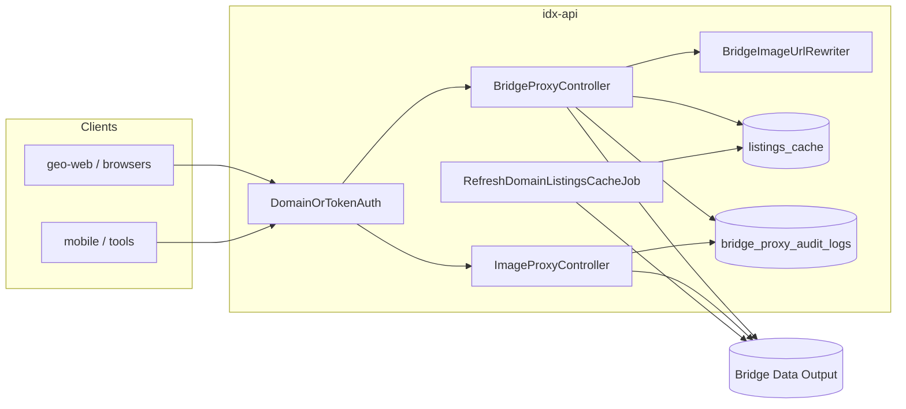

# IDX-API — Secured Bridge Data Output Proxy

This document describes the **Quantyra idx-api** integration that proxies [Bridge Data Output](https://bridgedataoutput.com) for the **Stellar** dataset, adds **domain / token authentication**, **listings caching**, **teaser gating**, **MLS audit logging**, **automatic rewriting of listing photo URLs in JSON** to the public **idx-images** host, and a secured **`/images/...`** binary proxy. Implementation lives in this repository.

**Upstream API reference** (endpoints, datasets, auth concepts): [bridge-api-documentation.md](bridge-api-documentation.md).

**Production base URL** (typical): `https://idx-api.quantyralabs.cc` — or your `APP_URL` / `IDX_API_PUBLIC_URL`.

---

## Goals

| Goal | How it is met |
|------|----------------|
| Single MLS egress | All Bridge calls go through Laravel `Http` using `BRIDGE_API_KEY` (server-side only). |
| Stellar MLS–style domain control | Requests must identify an **active** row in `domains` (via header, **`?domain=`** query, or `Referer` host) **or** present a valid **Sanctum personal access token** with IDX abilities. |
| Cost & latency control | Domain-scoped **`GET /api/v1/listings`** responses are cached in PostgreSQL (`listings_cache`) for **15 minutes** (configurable), gzip-compressed — **skipped** when **`filters`** is present so filtered feeds are never wrong. |
| Lead / revenue gating | Non–`idx:full` clients receive **teaser** JSON (first list slice capped at **3** items) where applicable. |
| Auditability | Every proxied JSON request and image hit writes a row to **`bridge_proxy_audit_logs`**. |
| Image CDN pattern | JSON responses rewrite Bridge **`…/listings/{key}/photos/{id}…`** URLs to **`{IDX_IMAGES_PUBLIC_URL}/images/{listingKey}/{photoId}`**; binary **`GET /images/...`** is served from the **`images`** filesystem disk with **long-lived immutable** cache headers for Cloudflare edge caching (see [Image proxy](#image-proxy) and [JSON image URL rewriting](#json-image-url-rewriting)). |

---

## Architecture (high level)



1. Client calls **`/api/v1/...`** or **`/images/...`** with domain identification or Bearer token.
2. **`DomainOrTokenAuth`** (`middleware` alias **`domain.token`**) allows the request or returns **401 / 403**.
3. **`BridgeProxyController`** builds the Bridge URL (Web API, RESO, or doc paths), forwards safe client headers and query string (internal params **`domain`** and **`teaser`** are **never** sent to Bridge), attaches **Bearer `BRIDGE_API_KEY`** to Bridge.
4. For **domain-authenticated** listing collection, **`ListingsCacheService`** may return gzip-stored JSON from **`listings_cache`** if younger than TTL **and** the request has **no** `filters` query; otherwise Bridge is called and the row is updated when caching applies.
5. **Teaser** may shrink list-shaped JSON; then **`BridgeImageUrlRewriter`** rewrites listing photo URLs in the JSON body to **`IDX_IMAGES_PUBLIC_URL`** (see below).
6. **`BridgeProxyAuditLogger`** persists audit metadata.

**GHL routes** (`/api/leadconnector/*`, widgets, web OAuth) are **not** wrapped by `domain.token`; see [GHL API & routes reference](ghl-api-routes-reference.md).

---

## Authentication & authorization

Middleware: **`App\Http\Middleware\DomainOrTokenAuth`**, registered as **`domain.token`** in `idx-api/bootstrap/app.php`.

### Option A — Registered domain

| Source | Rule |
|--------|------|
| `X-Domain-Slug` | Non-empty value is matched **case-insensitively** to `domains.domain_slug` (store full hostnames, e.g. `searchtampabayhouses.com`). |
| `GET ?domain=` | Same lookup as header when `X-Domain-Slug` is absent (useful for server clients that cannot set custom headers). **Not** forwarded to Bridge. |
| `Referer` | If neither header nor `domain` query is set, the **host** portion of `Referer` is used the same way. |

The domain must exist and **`is_active = true`**. Domain-authenticated callers **never** receive `idx:full`; teaser rules apply.

### Option B — Sanctum personal access token

| Header | Rule |
|--------|------|
| `Authorization: Bearer <token>` | Token must resolve via `PersonalAccessToken::findToken` and have **`idx:access`** and/or **`idx:full`**. |

| Ability | Effect |
|---------|--------|
| `idx:access` | Access allowed; **teaser** applies (list caps). |
| `idx:full` | Access allowed; **full** listing payloads (no list teaser cap in the proxy layer). |

Invalid or ability-missing tokens → **403**.

### Subscriber dashboard API keys (Ultra and Mega)

Subscribers on **Ultra** or **Mega** (active, valid default Cashier subscription matching catalog price IDs in `config/billing.php`) can create **personal access tokens** from the **GeoIDX dashboard** (`POST /dashboard/api-tokens`, “Generate API token”). Those tokens are meant for **`Authorization: Bearer …`** calls to **`/api/v1/*`** (same middleware as registered domains).

| Plan | Token abilities | Bridge / GIS behavior |
|------|-----------------|------------------------|
| **Ultra** | `idx:access` | Same teaser rules as **domain** identification (e.g. list-shaped responses capped for non–full access). |
| **Mega** | `idx:full` | Full payloads where the proxy applies `idx:full` (no list teaser cap in the proxy layer). |

**Pro** and **Smart** do not receive this UI gate: they cannot create these keys from the dashboard (plan is widget-focused; upgrade path remains Ultra/Mega for REST API keys).

**Not interchangeable with `POST /api/auth/token`:** the JSON login token endpoint issues Sanctum tokens with **`idx:read`** and **`idx:search`** for other flows. Those abilities do **not** satisfy `DomainOrTokenAuth` for `/api/v1` Bridge or GIS JSON. For server-side full access outside the dashboard, use the internal geo-web token pattern (`idx:full`): run **`php artisan idx-api:issue-geo-web-token`** (see `IssueGeoWebInternalTokenCommand`) or seed once via **`GeoWebInternalTokenSeeder`**.

After generation, the dashboard shows the raw token **once**; store it securely. Revocation: `DELETE /dashboard/api-tokens/{token}` from the dashboard UI.

---

### Teaser behavior

- Applies to successful JSON responses where the decoder finds a top-level list under **`value`**, **`bundle`**, **`d`**, **`listings`**, or a top-level JSON **array**.
- **Limit:** **3** items for non–`idx:full` contexts.
- Cached bytes in **`listings_cache`** store the **full** Bridge body; teaser is applied **after** decompressing so the cache stays canonical.
- **Image URL rewriting** runs **after** teaser on successful JSON so clients always see **`idx-images`** URLs regardless of teaser state.

---

## JSON image URL rewriting

Service: **`App\Services\Bridge\BridgeImageUrlRewriter`** (used by **`BridgeProxyController`** on successful JSON).

| Behavior | Detail |
|----------|--------|
| **Target URLs** | HTTPS URLs on configured Bridge hosts whose path contains **`/listings/{ListingKey}/photos/{PhotoId}`** (lazy match between host and `/listings/`). |
| **Output shape** | `{IDX_IMAGES_PUBLIC_URL}/images/{listingKey}/{photoId}` with path segments **URL-encoded** as needed. Default public base: **`https://idx-images.quantyralabs.cc`**. |
| **`Media[]` objects** | When **`MediaURL`** (and similar keys) appear under a parent with **`ListingKey`**, URLs are rewritten; if the URL is Bridge-hosted but not path-parseable, **`Order`** / **`MediaKey`** / **`Id`** may be used with the parent listing key. |
| **Extra hosts** | Optional comma-separated **`BRIDGE_IMAGE_REWRITE_HOSTS`** extends which hostnames are treated as rewritable Bridge image origins (beyond `bridgedataoutput.com`, `api.bridgedataoutput.com`, and the host of **`BRIDGE_HOST`**). |

Non-JSON or malformed JSON responses are passed through unchanged.

---

## HTTP routes

### JSON API (`/api/...`)

Laravel’s `routes/api.php` is prefixed with **`/api`**. All routes below use middleware **`domain.token`**.

#### Bridge Web API (dataset segment from `BRIDGE_DATASET`, default `stellar`)

| Method | Path | Upstream shape (see Bridge doc) |
|--------|------|----------------------------------|
| GET | `/api/v1/listings` | `/{dataset}/listings` |
| GET | `/api/v1/listings/{listingId}` | `/{dataset}/listings/{listingId}` |
| GET | `/api/v1/agents` | `/{dataset}/agents` |
| GET | `/api/v1/agents/{agentId}` | `/{dataset}/agents/{agentId}` |
| GET | `/api/v1/offices` | `/{dataset}/offices` |
| GET | `/api/v1/offices/{officeId}` | `/{dataset}/offices/{officeId}` |
| GET | `/api/v1/openhouses` | `/{dataset}/openhouses` |
| GET | `/api/v1/openhouses/{openhouseId}` | `/{dataset}/openhouses/{openhouseId}` |

#### RESO-style resources

Built from `BRIDGE_HOST`, optional `BRIDGE_PATH_PREFIX`, `BRIDGE_DATASET`, and optional `BRIDGE_RESO_ROOT` (see [Environment variables](#environment-variables)).

| Method | Path | Resource |
|--------|------|----------|
| GET | `/api/v1/properties` | `Property` collection |
| GET | `/api/v1/properties/{listingKey}` | `Property` by key |
| GET | `/api/v1/members` | `Member` collection |
| GET | `/api/v1/members/{memberKey}` | `Member` by key |
| GET | `/api/v1/reso-offices` | `Office` collection |
| GET | `/api/v1/reso-offices/{officeKey}` | `Office` by key |
| GET | `/api/v1/reso-openhouses` | `OpenHouse` collection |
| GET | `/api/v1/reso-openhouses/{openHouseKey}` | `OpenHouse` by key |
| GET | `/api/v1/lookup` | `Lookup` collection |

#### Public & ancillary paths (doc-style paths on `BRIDGE_HOST`)

| Method | Path | Notes |
|--------|------|--------|
| GET | `/api/v1/pub/parcels` | `/pub/parcels` |
| GET | `/api/v1/pub/parcels/{parcelId}` | `/pub/parcels/{id}` |
| GET | `/api/v1/pub/parcels/{parcelId}/assessments` | |
| GET | `/api/v1/pub/parcels/{parcelId}/transactions` | |
| GET | `/api/v1/pub/assessments` | `/pub/assessments` |
| GET | `/api/v1/pub/transactions` | `/pub/transactions` |
### Image proxy (no `/api` prefix)

Registered in **`bootstrap/app.php`** `then` routing callback with middleware **`api`** + **`domain.token`**.

| Method | Path | Behavior |
|--------|------|----------|
| GET | `/images/{listingKey}/{photoId}` | Proxies Bridge listing photo URL built from **`BRIDGE_LISTING_PHOTO_PATH`**, stores bytes on the Laravel **`images`** disk (**`config/filesystems.php`**), whose root defaults to **`IMAGE_CACHE_PATH`** (NVMe path in production Docker). |

**Host `idx-images.quantyralabs.cc` (Docker `idx-images` service):** **`Dockerfile.idx-images`** builds **nginx only** and **reverse-proxies** `GET /images/*` to **`http://idx-api:8000`** with the same forwarded headers (**`Referer`**, **`Authorization`**, **`X-Domain-Slug`**) so **Laravel enforces the identical domain / Sanctum gate** as on **`idx-api.quantyralabs.cc`**. There is **no** standalone `image-proxy.php` or `?url=` bypass — unauthorized requests are rejected by idx-api (**401 / 403**) before any MLS bytes are returned.

**Response headers**

| Header | Purpose |
|--------|---------|
| **`Cache-Control`** | **`public, max-age=31536000, immutable`** — optimized for **Cloudflare** (and other CDNs) to cache at the edge for one year; browsers reuse the object without revalidation churn. |
| **`X-IDX-Proxied-Public-Url`** | Canonical public URL: `{IDX_IMAGES_PUBLIC_URL}/images/{listingKey}/{photoId}`. |

**Origin refresh:** the app may **re-fetch** the binary from Bridge when the on-disk file is older than **`IMAGE_CACHE_TTL`** seconds (default 86400). That is independent of the **browser/CDN** `Cache-Control` above (edge stays hot; origin updates stay controlled).

**Traefik / Dokploy:** the default stack uses a dedicated **`idx-images`** container (nginx → idx-api). You may instead route **`idx-images.quantyralabs.cc`** directly to idx-api port **8000** in Traefik and drop the sidecar. JSON from **`/api/v1/*`** points browsers at **`idx-images.quantyralabs.cc`**; DNS and TLS must match your deployment.

---

## Database

| Table | Purpose |
|-------|---------|
| `domains` | `domain_slug` (unique), `is_active`. Seeds include approved hostnames (e.g. `searchtampabayhouses.com`). |
| `listings_cache` | **PK** `domain_slug`; `compressed_data` (gzip); `last_updated`; `etag`. One logical row per domain for the listings collection cache. |
| `bridge_proxy_audit_logs` | `logged_at`, `domain_slug`, `token_name`, `request_type`, `listing_count`, `ip_address`, `user_id` (nullable FK to `users`). |
| `personal_access_tokens` | Laravel Sanctum; used for **`geo-web-internal`** and other PATs. |

Migrations live under `idx-api/database/migrations/` (`2026_04_22_120000` … `120300`).

---

## Caching & jobs

| Mechanism | Detail |
|-----------|--------|
| **Listings DB cache** | **Only** `GET /api/v1/listings` when the caller authenticated as a **domain** (not token-only), and the request does **not** include a **`filters`** query (filtered queries always hit Bridge). TTL **`LISTINGS_CACHE_TTL`** seconds (default **900** = 15 minutes). |
| **Image filesystem cache** | Files on the **`images`** disk under `IMAGE_CACHE_PATH`; TTL **`IMAGE_CACHE_TTL`** (default 86400s) controls when idx-api **re-fetches** from Bridge — not the CDN `Cache-Control` on the HTTP response. |
| **Scheduled refresh** | `routes/console.php` schedules a callback every **15 minutes** that dispatches **`RefreshDomainListingsCacheJob`** once per **active** domain (database queue). Requires a **queue worker** in each environment where refreshes must run. |

---

## Environment variables

Set in **`idx-api/.env`** and/or root **`.env`** for Docker Compose. See also [GHL environment variables](ghl-environment-variables.md) for shared `IDX_*` URLs and core app settings (password hashing driver, etc.).

| Variable | Required | Description |
|----------|----------|-------------|
| `BRIDGE_API_KEY` | Yes (real Bridge) | Server token sent to Bridge as `Authorization: Bearer …`. |
| `BRIDGE_HOST` | No | Default in app config matches Bridge doc base; many accounts use `https://api.bridgedataoutput.com`. |
| `BRIDGE_DATASET` | No | Default `stellar`. |
| `BRIDGE_PATH_PREFIX` | No | e.g. `api/v2` → `{BRIDGE_HOST}/{prefix}/{dataset}/listings`. Empty string uses doc-style `{host}/{dataset}/listings`. |
| `BRIDGE_RESO_ROOT` | No | e.g. `reso/odata` → `{host}/reso/odata/{dataset}/Property`. Empty uses `{host}/{dataset}/Property`. |
| `BRIDGE_LISTING_PHOTO_PATH` | No | Path template for photos; supports `{dataset}`, `{listingKey}`, `{photoId}`. |
| `BRIDGE_IMAGE_REWRITE_HOSTS` | No | Comma-separated extra hostnames whose `…/listings/…/photos/…` URLs should be rewritten in JSON (in addition to defaults derived from **`BRIDGE_HOST`** and common Bridge domains). |
| `BRIDGE_TIMEOUT` | No | HTTP timeout seconds. |
| `LISTINGS_CACHE_TTL` | No | Seconds (default **900**). |
| `IMAGE_CACHE_PATH` | No | Root for the **`images`** filesystem disk and image proxy storage (Docker: `/var/cache/geoidx/images`). |
| `IMAGE_CACHE_TTL` | No | Seconds before idx-api **re-fetches** a file from Bridge (on-disk freshness). |
| `IDX_IMAGES_PUBLIC_URL` | No | Public hostname for marketing / headers (default `https://idx-images.quantyralabs.cc`). |
| `IDX_API_INTERNAL_TOKEN` | Ops / geo-web | Plaintext PAT for server-to-server calls; **issue via Artisan** (below). Not read automatically by idx-api logic—store where geo-web or scripts need it. |

**Dokploy defaults** in root `docker-compose.yml` set `BRIDGE_HOST`, `BRIDGE_PATH_PREFIX`, and `BRIDGE_RESO_ROOT` for common Bridge routing; override if Bridge returns 404.

---

## Sanctum — internal geo-web token

1. Ensure migrations have run (includes `personal_access_tokens`).
2. Create or rotate token and print env line:

```bash
cd idx-api
php artisan idx-api:issue-geo-web-token --force
```

Copy the printed `IDX_API_INTERNAL_TOKEN=...` into secrets / `.env` for **geo-web** (or other server clients). Abilities: **`idx:full`**, token name **`geo-web-internal`**.

**First-time seed:** `DatabaseSeeder` calls `GeoWebInternalTokenSeeder`, which creates the token **only if** a `geo-web-internal` token does not already exist for the internal user.

---

## Example requests

### Listings — registered domain (teaser)

```bash
curl -sS \
  -H 'X-Domain-Slug: searchtampabayhouses.com' \
  'https://idx-api.quantyralabs.cc/api/v1/listings?limit=50&offset=0'
```

### Listings — full (Sanctum)

```bash
curl -sS \
  -H "Authorization: Bearer ${IDX_API_INTERNAL_TOKEN}" \
  'https://idx-api.quantyralabs.cc/api/v1/listings?limit=50'
```

### Listings — using Referer instead of header

```bash
curl -sS \
  -H 'Referer: https://searchtampabayhouses.com/some-page' \
  'https://idx-api.quantyralabs.cc/api/v1/listings'
```

### Listings — `?domain=` query (no custom header)

```bash
curl -sS \
  'https://idx-api.quantyralabs.cc/api/v1/listings?domain=searchtampabayhouses.com&limit=50&offset=0'
```

### Inspect rewritten photo URL (requires `jq`)

```bash
curl -sS \
  -H 'X-Domain-Slug: searchtampabayhouses.com' \
  'https://idx-api.quantyralabs.cc/api/v1/listings?limit=1' | jq -r '.value[0].Media[0].MediaUrl // .value[0].Media[0].MediaURL // empty'
# Expect a URL starting with https://idx-images.quantyralabs.cc/images/…
```

### No authentication (expect 401)

```bash
curl -sS -i 'https://idx-api.quantyralabs.cc/api/v1/listings'
```

### Unknown domain (expect 403)

```bash
curl -sS -i \
  -H 'X-Domain-Slug: not-registered.example' \
  'https://idx-api.quantyralabs.cc/api/v1/listings'
```

### Image proxy

```bash
curl -sS -D - -o /tmp/photo.jpg \
  -H 'X-Domain-Slug: searchtampabayhouses.com' \
  'https://idx-api.quantyralabs.cc/images/LISTING_KEY/PHOTO_ID'
```

Response headers should include **`Cache-Control`** with **`public`**, **`max-age=31536000`**, and **`immutable`** (directive order may vary by Symfony).

---

## Docker & operations

- **Dockerfiles** live at the **project root** (`Dockerfile.idx-api`, `Dockerfile.idx-images`). Build context is always **`.`** — see **[README.md](../README.md)** and [GHL deployment & operations](ghl-deployment-and-operations.md).
- **Build / run** (repo root): `docker compose build` / `docker compose up` using root **`docker-compose.yml`**.
- **idx-api service** env: root `docker-compose.yml` passes Bridge-related variables and `IMAGE_CACHE_PATH=/var/cache/geoidx/images`; **`Dockerfile.idx-api`** creates that directory. The **`images`** disk in **`config/filesystems.php`** uses the same path for the image proxy.
- **Queue worker:** for `RefreshDomainListingsCacheJob` to execute, run e.g. `php artisan queue:work` (or Horizon) alongside the app. Schedule driver must run `php artisan schedule:run` (cron) or `schedule:work` in dev.

---

## Compliance & security notes

- Do **not** expose `BRIDGE_API_KEY` or Sanctum plaintext tokens to browsers or untrusted repos.
- Keep **`domains`** aligned with Stellar MLS / Exhibit A–approved hostnames.
- Retain **`bridge_proxy_audit_logs`** (and backups) according to your MLS compliance policy.
- Mobile remains teaser-oriented until contractual amendments allow full MLS display.

---

## Troubleshooting

| Symptom | Check |
|---------|--------|
| Bridge **404** on listings | `BRIDGE_HOST`, `BRIDGE_PATH_PREFIX`, and `BRIDGE_DATASET` against your Bridge account (Explorer / support). |
| RESO **404** | `BRIDGE_RESO_ROOT` (often `reso/odata`) and dataset spelling. |
| **401** on `/api/v1/*` | Missing `X-Domain-Slug` / `Referer` and missing Bearer token. |
| **403** domain | Row missing or `is_active = false` in `domains`. |
| **403** token | Wrong token or missing `idx:access` / `idx:full`. |
| Cache never hits | Listings cache is **domain-only**; Bearer-only calls always hit Bridge. With **`?filters=`**, listings cache is **skipped** by design. |
| Images empty | Photo URL template vs Bridge listing key format; verify `BRIDGE_LISTING_PHOTO_PATH`. |
| Photo URLs still show `api.bridgedataoutput.com` | Check **`BRIDGE_IMAGE_REWRITE_HOSTS`** and that URLs match **`/listings/{key}/photos/{id}`**; non-matching CDN patterns may need a code extension. |

---

## Related documentation

| Document | Topic |
|----------|--------|
| [bridge-api-documentation.md](bridge-api-documentation.md) | Bridge paths, datasets, conceptual overview. |
| [ghl-api-routes-reference.md](ghl-api-routes-reference.md) | GHL-specific idx-api routes (orthogonal to Bridge v1). |
| [ghl-environment-variables.md](ghl-environment-variables.md) | Shared `IDX_*` and deployment env patterns. |
| [ghl-deployment-and-operations.md](ghl-deployment-and-operations.md) | Docker, queues, scheduling. |
| [../README.md](../README.md) | Project Dockerfiles and local build layout. |
