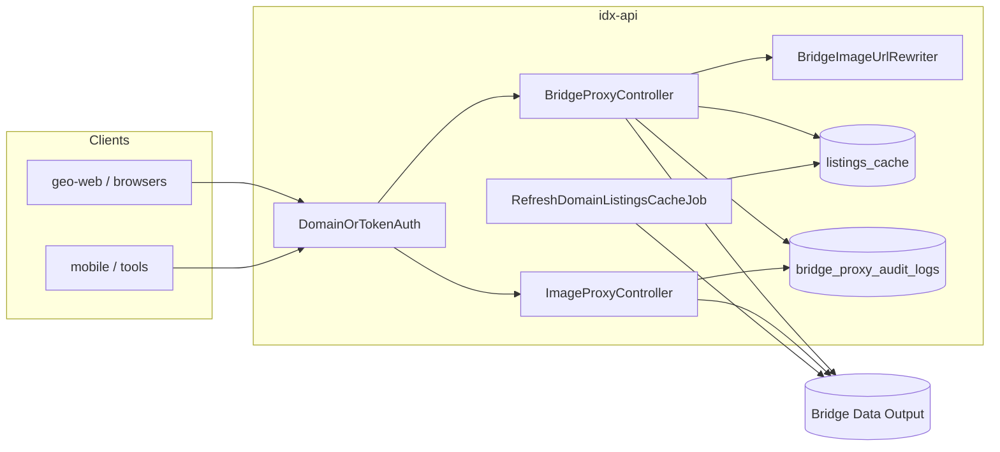

# IDX-API — Secured Bridge Data Output Proxy

This document describes the **Quantyra idx-api** integration that proxies [Bridge Data Output](https://bridgedataoutput.com) for multiple **MLS datasets** (Stellar, Miami, etc.), adds **domain / token authentication**, **listings and search caching**, **full JSON payloads** for authenticated internal traffic, **MLS audit logging**, **automatic rewriting of image URLs in JSON** (including CloudFront origins) to the public **idx-images** host, **OData cursor pagination support**, and a secured **`/images/...`** binary proxy. Implementation lives in this repository.

**Upstream API reference** (endpoints, datasets, auth concepts): [bridge-api-documentation.md](bridge-api-documentation.md).

**Production base URL** (typical): `https://idx-api.quantyralabs.cc` — or your `APP_URL` / `IDX_API_PUBLIC_URL`.

---

## Goals

| Goal | How it is met |
|------|----------------|
| Single MLS egress | All Bridge calls go through Laravel `Http` using `BRIDGE_API_KEY` (server-side only). |
| Multi-dataset MLS control | Requests identify an **active** row in `domains` (via header, **`?domain=`** query, or `Referer` host) **or** present a valid **Sanctum personal access token** with IDX abilities. Dataset access is validated against `domains.allowed_mls_datasets` (defaults to `domains.mls_dataset`). |
| Cost & latency control | Domain-scoped **`GET /api/v1/listings`** and **`POST /api/v1/search`** responses are cached in PostgreSQL (`listings_cache`, `bridge_search_cache`) for **15 minutes** (configurable), gzip-compressed — **skipped** when **`filters`** is present for collection endpoints so filtered feeds are never wrong. Search requests cache full payloads before the response is returned. |
| Hybrid map performance | Eligible `POST /api/v1/search` requests are served from a PostGIS replica (`listings`) for sub-50ms pan/zoom and radius workloads; non-eligible requests transparently fall back to live Bridge data. |
| Pricing enrichment | Listing responses include top-level `pricing` quotes and per-listing `pricing_converted` data sourced from local cache/DB snapshots refreshed asynchronously by queue job. |
| Access model | **Internal-only:** active, MLS-approved **domains** and **Sanctum personal access tokens** (with `idx:access` or `idx:full`, plus domain binding for PATs) receive full Bridge-shaped responses. There is **no** Stripe/Cashier subscription tier or plan-based response shrinking in this deployment. |
| Auditability | Every proxied JSON request and image hit writes a row to **`bridge_proxy_audit_logs`**. |
| Image CDN pattern | JSON responses rewrite Bridge **`…/listings/{key}/photos/{id}…`** and CloudFront URLs to **`{IDX_IMAGES_PUBLIC_URL}/images/{listingKey}/{photoId}`**; environment-specific normalization ensures consistent URLs across dev/staging/prod; binary **`GET /images/...`** is streamed from Bridge with **long-lived immutable** cache headers for Cloudflare edge caching (see [Image proxy](#image-proxy) and [JSON image URL rewriting](#json-image-url-rewriting)). |

---

## Architecture (high level)



1. Client calls **`/api/v1/...`** or **`/images/...`** with domain identification or Bearer token.
2. **`DomainOrTokenAuth`** (`middleware` alias **`domain.token`**) allows the request or returns **401 / 403**.
3. **`BridgeProxyController`** builds the Bridge URL (Web API, RESO, or doc paths), forwards safe client headers and query string (internal param **`domain`** is **never** sent to Bridge), attaches **Bearer `BRIDGE_API_KEY`** to Bridge.
4. For **domain-authenticated** listing collection, **`ListingsCacheService`** may return gzip-stored JSON from **`listings_cache`** if younger than TTL **and** the request has **no** `filters` query; otherwise Bridge is called and the row is updated when caching applies.
5. **`BridgeImageUrlRewriter`** rewrites listing photo URLs in successful JSON bodies to **`IDX_IMAGES_PUBLIC_URL`** (see below).
6. **`BridgeProxyAuditLogger`** persists audit metadata.

---

## Authentication & authorization

Middleware: **`App\Http\Middleware\DomainOrTokenAuth`**, registered as **`domain.token`** in `idx-api/bootstrap/app.php`.

### Option A — Registered domain

| Source | Rule |
|--------|------|
| `X-Domain-Slug` | Non-empty value is matched **case-insensitively** to `domains.domain_slug` (store full hostnames, e.g. `searchtampabayhouses.com`). |
| `GET ?domain=` | Same lookup as header when `X-Domain-Slug` is absent (useful for server clients that cannot set custom headers). **Not** forwarded to Bridge. |
| `Referer` | If neither header nor `domain` query is set, the **host** portion of `Referer` is used the same way. |

The domain must exist and **`is_active = true`**. Domain-authenticated callers receive the same full outbound MLS JSON as PAT traffic; `DomainOrTokenAuth` treats them as **full access** for proxy purposes.

### Option B — Sanctum personal access token

| Header | Rule |
|--------|------|
| `Authorization: Bearer <token>` | Token must resolve via `PersonalAccessToken::findToken` and have **`idx:access`** and/or **`idx:full`**. |

| Ability | Effect |
|---------|--------|
| `idx:access` | Access allowed (legacy ability name; same full proxy behavior as `idx:full` once authenticated). |
| `idx:full` | Access allowed; typical for dashboard PATs, `POST /api/auth/token`, and **`php artisan idx-api:issue-geo-web-token`**. |

Invalid or ability-missing tokens → **403**.

### Dashboard API keys

Authenticated users can create **personal access tokens** from the **GeoIDX dashboard** (`ApiTokenManager` Livewire component or `POST /dashboard/api-tokens`). New tokens are minted with **`idx:full`**. Every **`Authorization: Bearer …`** call to **`/api/v1/*`** must also send **`X-Domain-Slug`** or **`?domain=`** for a **TXT-verified** domain on the same account (same binding rules as `DomainOrTokenAuth`).

| Token source | Abilities | Bridge / GIS behavior |
|--------------|-----------|------------------------|
| **Dashboard PAT** | `idx:full` | Full Bridge / GIS JSON for authenticated requests. |
| **`POST /api/auth/token`** | `idx:full` | Same as dashboard PATs when used with domain identification (machine clients / scripts). |
| **Geo-web internal** | `idx:full` | Created via **`php artisan idx-api:issue-geo-web-token`** or **`GeoWebInternalTokenSeeder`**; pair with **`IDX_API_INTERNAL_TOKEN`** and a verified domain slug on requests. |

After generation, the dashboard shows the raw token **once**; store it securely. Revocation: `DELETE /dashboard/api-tokens/{token}` from the dashboard UI.

---

### Response shaping (authenticated)

- **`listings_cache`** stores the **full** gzip-compressed Bridge body; filtered collection requests bypass the cache by design.
- **`BridgeImageUrlRewriter`** runs on successful JSON so photo URLs resolve through **`idx-images`** for CDN and MLS compliance.

---

## JSON image URL rewriting

Service: **`App\Services\Bridge\BridgeImageUrlRewriter`** (used by **`BridgeProxyController`** on successful JSON).

| Behavior | Detail |
|----------|--------|
| **Target URLs** | HTTPS URLs on configured Bridge hosts whose path contains **`/listings/{ListingKey}/photos/{PhotoId}`** (lazy match between host and `/listings/`). |
| **CloudFront URLs** | URLs from CloudFront (`*.cloudfront.net`) are also rewritten to `idx-images` format. |
| **Environment normalization** | Any URL already pointing to an `idx-images` host is normalized to the current environment's `IDX_IMAGES_PUBLIC_URL`. This ensures URLs from cached responses (potentially from different environments) resolve correctly. |
| **Output shape** | `{IDX_IMAGES_PUBLIC_URL}/images/{listingKey}/{photoId}` with path segments **URL-encoded** as needed. Default public base: **`https://idx-images.quantyralabs.cc`**. |
| **`Media[]` objects** | When **`MediaURL`** (and similar keys) appear under a parent with **`ListingKey`**, URLs are rewritten; if the URL is Bridge-hosted but not path-parseable, **`Order`** / **`MediaKey`** / **`Id`** may be used with the parent listing key. |
| **Extra hosts** | Optional comma-separated **`BRIDGE_IMAGE_REWRITE_HOSTS`** extends which hostnames are treated as rewritable Bridge image origins (beyond `bridgedataoutput.com`, `api.bridgedataoutput.com`, and the host of **`BRIDGE_HOST`**). |

Non-JSON or malformed JSON responses are passed through unchanged.

---

## HTTP routes

### JSON API (`/api/...`)

Laravel’s `routes/api.php` is prefixed with **`/api`**. All routes below use middleware **`domain.token`**.

#### Bridge Web API (dataset segment from `BRIDGE_DATASET`, default `stellar`)

| Method | Path | Upstream shape (see Bridge doc) |
|--------|------|----------------------------------|
| GET | `/api/v1/listings` | `/{dataset}/listings` |
| GET | `/api/v1/listings/{listingId}` | `/{dataset}/listings/{listingId}` |
| GET | `/api/v1/agents` | `/{dataset}/agents` |
| GET | `/api/v1/agents/{agentId}` | `/{dataset}/agents/{agentId}` |
| GET | `/api/v1/offices` | `/{dataset}/offices` |
| GET | `/api/v1/offices/{officeId}` | `/{dataset}/offices/{officeId}` |
| GET | `/api/v1/openhouses` | `/{dataset}/openhouses` |
| GET | `/api/v1/openhouses/{openhouseId}` | `/{dataset}/openhouses/{openhouseId}` |

#### RESO-style resources

Built from `BRIDGE_HOST`, optional `BRIDGE_PATH_PREFIX`, `BRIDGE_DATASET`, and optional `BRIDGE_RESO_ROOT` (see [Environment variables](#environment-variables)).

| Method | Path | Resource | Notes |
|--------|------|----------|-------|
| GET, POST | `/api/v1/properties` | `Property` collection | POST accepts JSON body with `city`, `limit`, `cursor`, etc. Query params auto-translated to OData `$filter`, `$top`. |
| GET | `/api/v1/properties/{listingKey}` | `Property` by key | |
| GET | `/api/v1/members` | `Member` collection | |
| GET | `/api/v1/members/{memberKey}` | `Member` by key | |
| GET | `/api/v1/reso-offices` | `Office` collection | |
| GET | `/api/v1/reso-offices/{officeKey}` | `Office` by key | |
| GET | `/api/v1/reso-openhouses` | `OpenHouse` collection | |
| GET | `/api/v1/reso-openhouses/{openHouseKey}` | `OpenHouse` by key | |
| GET | `/api/v1/lookup` | `Lookup` collection | 30-day gzip cache per dataset + query fingerprint; clear with `php artisan bridge:clear-lookups-cache`. |
| POST | `/api/v1/search` | Structured search | Accepts `SearchRequest` JSON; translates to Bridge RESO OData with multi-dataset support, returns paginated results with stats. See [Search endpoint](#search-endpoint-post-apiv1search). |
| GET | `/api/v1/bridge/stats` | Replica stats | Returns per-dataset replica row counts and last sync timestamps from `listing_sync_cursors`. |
| POST | `/api/v1/comps/run` | Bridge comps + investor analysis | Supports modes `A`–`E`, `rent_hold_cashflow`, `flip_vs_hold`, `appraiser_simulation`, `bpo`, `home_value` for authenticated `domain.token` callers. See [Comps API](comps-api.md). |

#### Public & ancillary paths (doc-style paths on `BRIDGE_HOST`)

| Method | Path | Notes |
|--------|------|--------|
| GET | `/api/v1/pub/parcels` | `/pub/parcels` |
| GET | `/api/v1/pub/parcels/{parcelId}` | `/pub/parcels/{id}` |
| GET | `/api/v1/pub/parcels/{parcelId}/assessments` | |
| GET | `/api/v1/pub/parcels/{parcelId}/transactions` | |
| GET | `/api/v1/pub/assessments` | `/pub/assessments` |
| GET | `/api/v1/pub/transactions` | `/pub/transactions` |

Note: Zillow Zestimates (`/api/v1/zestimates/*`) and Reviews (`/api/v1/reviews/*`) endpoints are not available.
### Image proxy (no `/api` prefix)

Registered in **`bootstrap/app.php`** `then` routing callback with middleware **`api`** + **`domain.token`**.

| Method | Path | Behavior |
|--------|------|----------|
| GET | `/images/{listingKey}/{photoId}` | Proxies Bridge listing photo URL built from **`BRIDGE_LISTING_PHOTO_PATH`** and streams bytes directly to the client with immutable cache headers. |

**Host `idx-images.quantyralabs.cc` (Docker `idx-images` service):** **`Dockerfile.idx-images`** builds **nginx only** and **reverse-proxies** `GET /images/*` to **`http://idx-api:8000`** with the same forwarded headers (**`Referer`**, **`Authorization`**, **`X-Domain-Slug`**) so **Laravel enforces the identical domain / Sanctum gate** as on **`idx-api.quantyralabs.cc`**. There is **no** standalone `image-proxy.php` or `?url=` bypass — unauthorized requests are rejected by idx-api (**401 / 403**) before any MLS bytes are returned.

**Response headers**

| Header | Purpose |
|--------|---------|
| **`Cache-Control`** | **`public, max-age=31536000, immutable`** — optimized for **Cloudflare** (and other CDNs) to cache at the edge for one year; browsers reuse the object without revalidation churn. |
| **`X-IDX-Proxied-Public-Url`** | Canonical public URL: `{IDX_IMAGES_PUBLIC_URL}/images/{listingKey}/{photoId}`. |

**Traefik / Dokploy:** the default stack uses a dedicated **`idx-images`** container (nginx → idx-api). You may instead route **`idx-images.quantyralabs.cc`** directly to idx-api port **8000** in Traefik and drop the sidecar. JSON from **`/api/v1/*`** points browsers at **`idx-images.quantyralabs.cc`**; DNS and TLS must match your deployment.

---

## Database

| Table | Purpose |
|-------|---------|
| `domains` | `domain_slug` (unique), `is_active`, `mls_dataset` (default), `allowed_mls_datasets` (JSON array of permitted datasets). Seeds include approved hostnames (e.g. `searchtampabayhouses.com`). |
| `listings_cache` | **PK** `domain_slug`; `compressed_data` (gzip); `last_updated`; `etag`. One logical row per domain for the listings collection cache. |
| `bridge_search_cache` | **PK** (`partition_key`, `fingerprint`); `compressed_data` (gzip); `last_updated`. Caches `POST /api/v1/search`, `GET/POST /api/v1/properties`, and `GET /api/v1/lookup` responses by request fingerprint. Lookups use a 30-day TTL; search/properties use 15-minute TTL. |
| `crypto_price_snapshots` | **Unique** (`asset_id`, `vs_currency`); stores latest CoinGecko price per pair with `as_of` for listing enrichment. |
| `bridge_proxy_audit_logs` | `logged_at`, `domain_slug`, `token_name`, `request_type`, `listing_count`, `ip_address`, `user_id` (nullable FK to `users`). |
| `personal_access_tokens` | Laravel Sanctum; used for **`geo-web-internal`** and other PATs. |

Migrations live under `idx-api/database/migrations/` (`2026_04_22_120000` … `120300`).

---

## Search endpoint (`POST /api/v1/search`)

The structured search endpoint accepts JSON payloads with filter criteria, translates them to Bridge RESO OData queries, caches results, and returns paginated listings with computed statistics.

### Request body (SearchRequest)

```json
{
  "mls_dataset": "stellar",
  "focus_areas": [
    {"cities": ["Tampa", "St. Petersburg"], "state_or_province": "FL"},
    {"counties_or_parishes": ["Hillsborough"], "state_or_province": "FL"}
  ],
  "price_min": 300000,
  "price_max": 750000,
  "bedrooms_min": 3,
  "bathrooms_min": 2,
  "property_types": ["Residential"],
  "status": ["Active", "Pending"],
  "waterfront": true,
  "pool": true,
  "garage_spaces_min": 2,
  "year_built_min": 2010,
  "sqft_min": 1500,
  "lot_size_min": 5000,
  "sort_by": "price_desc",
  "limit": 20,
  "page": 1
}
```

### Filter to OData mapping

| Search Filter | Bridge OData Field |
|---------------|-------------------|
| `cities` | `City` (case-insensitive `contains`) |
| `counties_or_parishes` | `CountyOrParish` |
| `state_or_province` | `StateOrProvince` |
| `price_min/max` | `ListPrice` |
| `bedrooms_min` | `BedroomsTotal` |
| `bathrooms_min` (full) | `BathroomsFull` |
| `bathrooms_min` (total) | `BathroomsTotal` |
| `property_types` | `PropertyType` |
| `status` / `statuses` | `StandardStatus` |
| `waterfront` | `WaterfrontYN` |
| `pool` | `PoolPrivateYN` |
| `garage_spaces_min` | `GarageSpaces` |
| `year_built_min` | `YearBuilt` |
| `sqft_min` | `LivingArea` |
| `lot_size_min` | `LotSizeSquareFeet` |
| `flood_zones` | `FloodZone` (post-filtered if unsupported upstream) |

### Dataset restrictions

The `MlsDatasetResolver` service validates dataset access:

1. If `mls_dataset` is provided in the request, it must be in the domain's `allowed_mls_datasets` array
2. If omitted, the domain's `mls_dataset` default is used
3. If the default is not allowed, the first allowed dataset is used as fallback
4. Returns **403** if no valid dataset can be resolved

---

## OData pagination & cursor support

RESO collection endpoints (`/api/v1/properties`, search results) support OData cursor pagination via the `@odata.nextLink` response field.

### Requesting paginated results

**Using query params (GET):**
```bash
curl -H "X-Domain-Slug: example.com" \
  'https://idx-api.quantyralabs.cc/api/v1/properties?city=largo&limit=10'
```

**Using JSON body (POST):**
```bash
curl -X POST -H "X-Domain-Slug: example.com" \
  -H "Content-Type: application/json" \
  -d '{"city": "Largo", "limit": 10}' \
  'https://idx-api.quantyralabs.cc/api/v1/properties'
```

### Following cursors

Responses include `@odata.nextLink` when more results are available:

```json
{
  "@odata.context": "...",
  "value": [...],
  "@odata.nextLink": "https://idx-api.quantyralabs.cc/api/v1/properties?cursor=eyJ0b3AiOjEwLCJza2lwIjoxMH0"
}
```

Follow the cursor to retrieve the next page:
```bash
curl -H "X-Domain-Slug: example.com" \
  'https://idx-api.quantyralabs.cc/api/v1/properties?cursor=eyJ0b3AiOjEwLCJza2lwIjoxMH0'
```

**Features:**
- Cursor values are opaque tokens encoding OData `$top`/`$skip` state
- Cursored results are cached separately with the same 15-minute TTL
- `@odata.id` values in entities are rewritten to proxy URLs
- All pagination is subject to domain/token authentication (`domain.token`)

---

## Caching & jobs

| Mechanism | Detail |
|-----------|--------|
| **Listings DB cache** | **Only** `GET /api/v1/listings` when the caller authenticated as a **domain** (not token-only), and the request does **not** include a **`filters`** query (filtered queries always hit Bridge). TTL **`LISTINGS_CACHE_TTL`** seconds (default **900** = 15 minutes). |
| **Search cache** | `POST /api/v1/search` results cached by fingerprint (dataset + normalized search params) per domain/token. Also caches `GET/POST /api/v1/properties` when no `?filters=` present. TTL **`LISTINGS_CACHE_TTL`** (default **900** = 15 minutes). |
| **Replica sync** | Every **15 minutes**, `BridgeSyncJob` (kickoff) dispatches `BridgeSyncFetchPageJob` on the **`bridge-sync`** queue. Each fetch job performs one Bridge HTTP page (rate-limited), then chains `BridgePersistReplicaChunkJob` batches (default **100** rows/job) so worker RAM stays bounded; the last chunk advances `listing_sync_cursors` and chains the next fetch. Mirror scope is **Active + Pending** only; Closed/other statuses are purged from replica rows. Default queries use `$unselect=Media` unless `BRIDGE_SYNC_INCLUDE_MEDIA=true`. |
| **Replica purge** | `PurgeClosedListingsJob` runs daily and deletes Closed rows and rows older than the rolling mirror window (`BRIDGE_LOCAL_MIRROR_ROLLING_MONTHS`, default 12). |
| **Lookups cache** | `GET /api/v1/lookup` responses cached by dataset + query fingerprint (`lookups:{dataset}`). TTL **`BRIDGE_LOOKUPS_CACHE_TTL`** (default **2,592,000** = 30 days). Clear with `php artisan bridge:clear-lookups-cache [--all|--dataset=stellar]`. |
| **Image edge cache** | `/images/*` responses are streamed from Bridge with immutable cache headers so Cloudflare/browser edges cache aggressively. |
| **Scheduled refresh** | `routes/console.php` schedules a callback every **15 minutes** that dispatches **`RefreshDomainListingsCacheJob`** once per **active** domain (database queue). Requires a **queue worker** in each environment where refreshes must run. |

---

## Environment variables

Set in **`idx-api/.env`** and/or root **`.env`** for Docker Compose. See root **`.env.example`** for `IDX_*` URLs and core app settings (password hashing driver, etc.).

| Variable | Required | Description |
|----------|----------|-------------|
| `BRIDGE_API_KEY` | Yes (real Bridge) | Server token sent to Bridge as `Authorization: Bearer …`. |
| `BRIDGE_HOST` | No | Default in app config matches Bridge doc base; many accounts use `https://api.bridgedataoutput.com`. |
| `BRIDGE_DATASET` | No | Default `stellar`. |
| `BRIDGE_PATH_PREFIX` | No | e.g. `api/v2` → `{BRIDGE_HOST}/{prefix}/{dataset}/listings`. Empty string uses doc-style `{host}/{dataset}/listings`. |
| `BRIDGE_RESO_ROOT` | No | e.g. `reso/odata` → `{host}/reso/odata/{dataset}/Property`. Empty uses `{host}/{dataset}/Property`. The system tries multiple URL patterns automatically if 404 is received. |
| `BRIDGE_LISTING_PHOTO_PATH` | No | Path template for photos; supports `{dataset}`, `{listingKey}`, `{photoId}`. |
| `BRIDGE_IMAGE_REWRITE_HOSTS` | No | Comma-separated extra hostnames whose `…/listings/…/photos/…` URLs should be rewritten in JSON (in addition to defaults derived from **`BRIDGE_HOST`** and common Bridge domains). |
| `BRIDGE_TIMEOUT` | No | HTTP timeout seconds. |
| `LISTINGS_CACHE_TTL` | No | Seconds (default **900**). |
| `BRIDGE_LOOKUPS_CACHE_TTL` | No | Lookup cache TTL in seconds (default **2,592,000** = 30 days). |
| `BRIDGE_SYNC_QUEUE` | No | Queue for kickoff, fetch, and persist jobs (default **`bridge-sync`**). Worker must listen to this queue. |
| `BRIDGE_SYNC_REPLICATION_TOP` | No | Replication `$top` page size (max 2000; default 2000). Must be an integer, not a URL. |
| `BRIDGE_SYNC_INCREMENTAL_TOP` | No | Incremental `Property` `$top` page size (max 200; default 200). Must be an integer, not a URL. |
| `BRIDGE_SYNC_MAX_CHAINED_FETCH_PAGES` | No | Optional safety cap on chained fetch jobs per kickoff (**0** = unlimited). |
| `BRIDGE_SYNC_MAX_REQUESTS_PER_MINUTE` | No | Proactive Bridge GET budget per minute (default **280**, max 334 burst). |
| `BRIDGE_SYNC_MIN_FETCH_INTERVAL_MS` | No | Minimum delay between fetch jobs in milliseconds (default **200**). |
| `BRIDGE_SYNC_INCLUDE_MEDIA` | No | When **false** (default), sync adds `$unselect=Media` to reduce payload size. |
| `BRIDGE_SYNC_PERSIST_JOB_CHUNK` | No | Rows per persist queue job (default **100**); lower if workers hit memory limits. |
| `BRIDGE_SYNC_MAX_REPLICATION_PAGES` | No | **Deprecated** — monolithic job page cap; pipeline chains until cursor clears. |
| `BRIDGE_SYNC_MAX_INCREMENTAL_PAGES` | No | **Deprecated** — monolithic job page cap. |
| `BRIDGE_SYNC_MAX_HTTP_RETRIES` | No | Max retry attempts for sync HTTP 429/503 handling (default 4). |
| `BRIDGE_LOCAL_MIRROR_ROLLING_MONTHS` | No | Rolling replica retention window in months (default 12). |
| `BRIDGE_SYNC_UPSERT_CHUNK` | No | Upsert chunk size for batched Postgres writes (25-500, default 250). |
| `IDX_IMAGES_PUBLIC_URL` | No | Public hostname for marketing / headers (default `https://idx-images.quantyralabs.cc`). Used for both image URL rewriting and environment normalization. |
| `IDX_API_INTERNAL_TOKEN` | Ops / geo-web | Plaintext PAT for server-to-server calls; **issue via Artisan** (below). Not read automatically by idx-api logic—store where geo-web or scripts need it. |
| `COINGECKO_API_KEY` | Recommended | CoinGecko API key used by scheduled pricing refresh job. |
| `COINGECKO_BASE_URL` | No | CoinGecko API base URL (`https://api.coingecko.com/api/v3` by default). |
| `COINGECKO_ASSET_IDS` | No | Comma-separated tracked assets (default `btc,eth,sol,xrp,ada`). |
| `COINGECKO_VS_CURRENCIES` | No | Comma-separated target fiats (default `usd,cad,eur,gbp,mxn`). |
| `COINGECKO_CACHE_KEY` | No | Cache key for quote matrix (default `coingecko.pricing.matrix`). |
| `COINGECKO_CACHE_TTL_SECONDS` | No | Quote matrix cache TTL in seconds (default `1200`). |
| `COINGECKO_QUEUE` | No | Queue name for scheduled pricing refresh job (default `default`). |

**Dokploy defaults** in root `docker-compose.yml` set `BRIDGE_HOST`, `BRIDGE_PATH_PREFIX`, and `BRIDGE_RESO_ROOT` for common Bridge routing; override if Bridge returns 404.

---

## Sanctum — internal geo-web token

1. Ensure migrations have run (includes `personal_access_tokens`).
2. Create or rotate token and print env line:

```bash
cd idx-api
php artisan idx-api:issue-geo-web-token --force
```

Copy the printed `IDX_API_INTERNAL_TOKEN=...` into secrets / `.env` for **geo-web** (or other server clients). Abilities: **`idx:full`**, token name **`geo-web-internal`**.

### Clear lookups cache

```bash
# Clear lookups cache for a specific dataset
php artisan bridge:clear-lookups-cache --dataset=stellar

# Clear lookups cache for all datasets
php artisan bridge:clear-lookups-cache --all
```

**First-time seed:** `DatabaseSeeder` calls `GeoWebInternalTokenSeeder`, which creates the token **only if** a `geo-web-internal` token does not already exist for the internal user.

---

## Example requests

### Listings — registered domain

```bash
curl -sS \
  -H 'X-Domain-Slug: searchtampabayhouses.com' \
  'https://idx-api.quantyralabs.cc/api/v1/listings?limit=50&offset=0'
```

### Listings — Sanctum PAT (requires domain binding)

```bash
curl -sS \
  -H "Authorization: Bearer ${IDX_API_INTERNAL_TOKEN}" \
  -H 'X-Domain-Slug: searchtampabayhouses.com' \
  'https://idx-api.quantyralabs.cc/api/v1/listings?limit=50'
```

### Listings — using Referer instead of header

```bash
curl -sS \
  -H 'Referer: https://searchtampabayhouses.com/some-page' \
  'https://idx-api.quantyralabs.cc/api/v1/listings'
```

### Listings — `?domain=` query (no custom header)

```bash
curl -sS \
  'https://idx-api.quantyralabs.cc/api/v1/listings?domain=searchtampabayhouses.com&limit=50&offset=0'
```

### Inspect rewritten photo URL (requires `jq`)

```bash
curl -sS \
  -H 'X-Domain-Slug: searchtampabayhouses.com' \
  'https://idx-api.quantyralabs.cc/api/v1/listings?limit=1' | jq -r '.value[0].Media[0].MediaUrl // .value[0].Media[0].MediaURL // empty'
# Expect a URL starting with https://idx-images.quantyralabs.cc/images/…
```

### No authentication (expect 401)

```bash
curl -sS -i 'https://idx-api.quantyralabs.cc/api/v1/listings'
```

### Unknown domain (expect 403)

```bash
curl -sS -i \
  -H 'X-Domain-Slug: not-registered.example' \
  'https://idx-api.quantyralabs.cc/api/v1/listings'
```

### Image proxy

```bash
curl -sS -D - -o /tmp/photo.jpg \
  -H 'X-Domain-Slug: searchtampabayhouses.com' \
  'https://idx-api.quantyralabs.cc/images/LISTING_KEY/PHOTO_ID'
```

Response headers should include **`Cache-Control`** with **`public`**, **`max-age=31536000`**, and **`immutable`** (directive order may vary by Symfony).

### Search with filters (POST)

```bash
curl -sS -X POST \
  -H 'X-Domain-Slug: searchtampabayhouses.com' \
  -H 'Content-Type: application/json' \
  -d '{"cities": ["Tampa", "St. Petersburg"], "price_min": 300000, "limit": 20}' \
  'https://idx-api.quantyralabs.cc/api/v1/search'
```

### Properties with JSON body (POST)

```bash
curl -sS -X POST \
  -H 'X-Domain-Slug: searchtampabayhouses.com' \
  -H 'Content-Type: application/json' \
  -d '{"city": "Largo", "limit": 10}' \
  'https://idx-api.quantyralabs.cc/api/v1/properties'
```

### Follow OData cursor pagination

```bash
# Initial request
curl -sS \
  -H 'X-Domain-Slug: searchtampabayhouses.com' \
  'https://idx-api.quantyralabs.cc/api/v1/properties?city=largo&limit=10' | jq '.["@odata.nextLink"]'

# Follow cursor
curl -sS \
  -H 'X-Domain-Slug: searchtampabayhouses.com' \
  'https://idx-api.quantyralabs.cc/api/v1/properties?cursor=eyJ0b3AiOjEwLCJza2lwIjoxMH0'
```

---

## Docker & operations

- **Dockerfiles** live at the **project root** (`Dockerfile.production`, `Dockerfile.staging`, `Dockerfile.idx-images`). Build context is always **`.`** — see **[README.md](../README.md)**, [Deployment & operations](deployment-operations.md), and [Coolify deployment](coolify-deployment.md).
- **Build / run** (repo root): `docker compose -f docker-compose.dev.yml build` / `up` for local dev (see `./scripts/docker-dev.sh`).
- **idx-api service** env: root `docker-compose.yml` passes Bridge-related variables used for proxy + rewrite behavior (`BRIDGE_*`, `IDX_IMAGES_PUBLIC_URL`).
- **Queue worker:** for `RefreshDomainListingsCacheJob` and `RefreshCryptoPricingJob` to execute, run e.g. `php artisan queue:work` (or Horizon) alongside the app. Schedule driver must run `php artisan schedule:run` (cron) or `schedule:work` in dev.

---

## Compliance & security notes

- Do **not** expose `BRIDGE_API_KEY` or Sanctum plaintext tokens to browsers or untrusted repos.
- Keep **`domains`** aligned with Stellar MLS / Exhibit A–approved hostnames.
- Retain **`bridge_proxy_audit_logs`** (and backups) according to your MLS compliance policy.
- Mobile and embedded clients must still follow your MLS / board rules for field display, attribution, and refresh cadence—proxy responses are full JSON, but **what you render** may be constrained by license agreements.

---

## Troubleshooting

| Symptom | Check |
|---------|--------|
| Bridge **404** on listings | `BRIDGE_HOST`, `BRIDGE_PATH_PREFIX`, and `BRIDGE_DATASET` against your Bridge account (Explorer / support). The system automatically tries multiple RESO URL patterns if 404 is received. |
| RESO **404** "Dataset not found" | Dataset may not be enabled for your Bridge account or `BRIDGE_RESO_ROOT` may be incorrect. |
| RESO **400** "Invalid parameter" | Query params like `city` or `limit` must be sent via JSON body (POST) or translated to OData (`$filter`, `$top`). The `/properties` endpoint handles this translation automatically. |
| **401** on `/api/v1/*` | Missing `X-Domain-Slug` / `Referer` and missing Bearer token. |
| **403** domain | Row missing or `is_active = false` in `domains`. |
| **403** token | Wrong token, missing `idx:access` / `idx:full`, domain not owned by token user, or domain not **TXT-verified** for PAT access. |
| **403** "Dataset not allowed" | The requested `mls_dataset` is not in the domain's `allowed_mls_datasets`. Check the domain configuration. |
| Cache never hits | Listings cache is **domain-only**; Bearer-only calls always hit Bridge. With **`?filters=`**, listings cache is **skipped** by design. Search cache requires `partition_key` (domain slug or user ID). |
| `@odata.nextLink` returns wrong host | The proxy rewrites `nextLink` URLs to the current host. Verify request `Host` header or `APP_URL`. |
| Images empty | Photo URL template vs Bridge listing key format; verify `BRIDGE_LISTING_PHOTO_PATH`. |
| Photo URLs still show `api.bridgedataoutput.com` or CloudFront | Check **`BRIDGE_IMAGE_REWRITE_HOSTS`** and that URLs match **`/listings/{key}/photos/{id}`**; non-matching CDN patterns may need a code extension. CloudFront URLs are automatically rewritten. |
| Image URLs from cache point to wrong environment | URLs containing `idx-images` are normalized to `IDX_IMAGES_PUBLIC_URL` during JSON rewriting. Verify this env var matches your deployment. |

---

## Related documentation

| Document | Topic |
|----------|--------|
| [bridge-api-documentation.md](bridge-api-documentation.md) | Bridge paths, datasets, conceptual overview. |
| [deployment-operations.md](deployment-operations.md) | Docker, queues, scheduling, Dokploy. |
| [coolify-deployment.md](coolify-deployment.md) | Coolify production & staging. |
| [../README.md](../README.md) | Project Dockerfiles and local build layout. |
