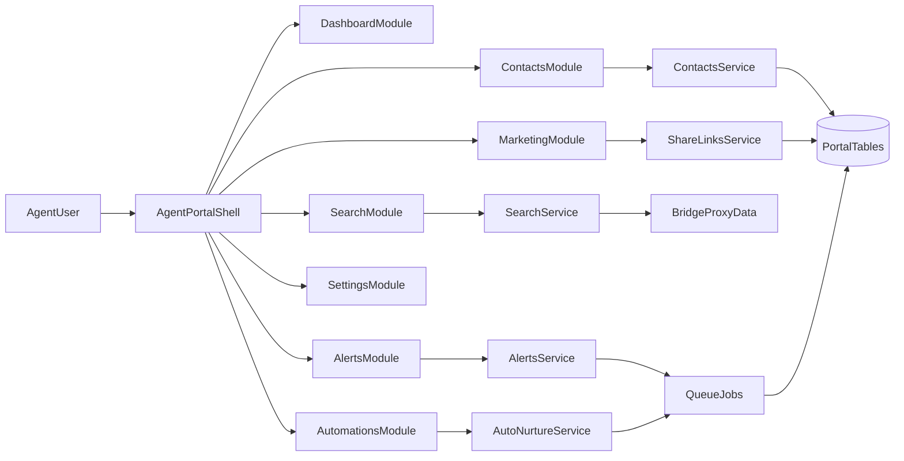
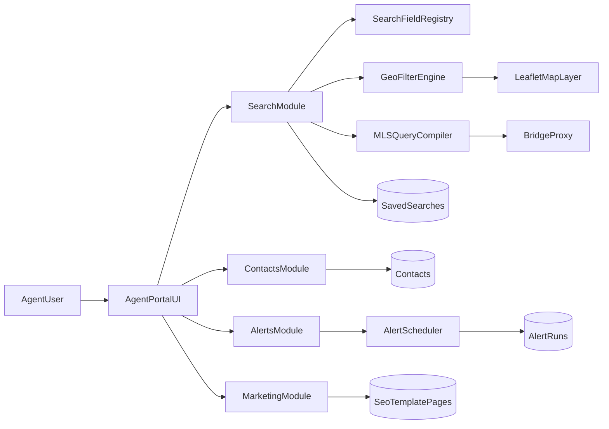

# Filament Agent Portal Parity Plan

## Canonical plan location (merged)

- **Cursor — single merged plan (canonical body):** `~/.cursor/plans/idx-agent-portal-parity_eef1bb43.plan.md` — workstreams, MLS/multi-MLS rules, concrete data contract, risks, diagrams, and benchmark sections merged from the former RealScout-only plan.
- **Superseded Cursor stub (redirect only):** `~/.cursor/plans/realscout-portal-parity_fe89a790.plan.md` — points at the canonical file so only one live plan body is maintained.
- **This markdown file** is the repository-local mirror of that merged plan for reviews and PRs (paths inside the repo use normal repo-relative paths).

## Goal

Implement RealScout-like Agent Portal functionality immediately inside the existing Filament dashboard while also restyling current dashboard experiences to a similar interaction and visual standard, without using RealScout logos, trademarks, or proprietary visual assets.

## Product Requirements

- Build all new parity functionality as part of the Filament dashboard.
- Restyle all existing dashboard surfaces to a cohesive RealScout-like UX pattern.
- Preserve Quantyra branding and identity (no RealScout logo/brand reuse).
- Prioritize high-granularity search + map workflows for lead/client alerts and SEO landing page generation.
- Implement now (no deferred-later phase gating for core scope).
- Enforce subscriber-specific IDX feed and dataset access across search, alerts, templates, and widgets.
- Preserve and extend existing onboarding functionality in Filament during rollout.

## Source benchmark: RealScout agent portal (functional map)

Captured from product exploration; Quantyra must not reuse RealScout branding, logos, or proprietary copy—only workflow and information-design parity.

- **Auth + role routing:** agent login path and role-specific portal entry.
- **Dashboard:** engagement metrics cards, contact highlight lists/tabs, hand-picked alerts review, live feed/activity stream, period toggles (`7D/30D/90D`).
- **Contacts (CRM grid):** segmented tabs (nurtured/awaiting/archive), quick filters, bulk actions/export, searchable/sortable table, row actions.
- **Contact detail workspace:** overview metrics, viewed listings, alert tabs, email/site activity, metadata sidebar, notes/tags.
- **Search workspace:** split layout (filters + map + results table), map tools (draw, zoom, fullscreen), save search/share listings.
- **Email Alerts:** listing-alert dashboard with status tabs, schedules, next-send, create/update flows.
- **Automations:** Auto Nurture settings, mode/status controls, FAQ/help, per-contact eligibility management.
- **Integrations:** external connectors (CRM + marketing + pixel), credential/API-key forms, reconnect/disconnect states.
- **Marketing tools:** shareable link builder, quick/advanced/listing templates, attribution tags/UTMs, performance columns.
- **Account settings:** lead registration gates, notification/billing tabs, feature toggles for client experience.

## Functional Parity Targets

- Dashboard analytics and activity feed.
- Contacts grid and contact detail workspace.
- Advanced search with large field catalog and include/exclude geometry.
- Listing alerts, market activity alerts, home value alerts.
- Alert templates + automation settings.
- Marketing utilities (share links, test market, listings tools, widgets).
- Account and notification settings.

## Implementation Architecture (Filament-First)

- Use Filament Pages/Resources/Widgets as primary rendering and interaction layer.
- Keep search/query and alert orchestration logic in service classes.
- Keep map + geometry filtering in dedicated map/search service modules.
- Use conventional Laravel routes only for API-like endpoints and non-Filament needs.

## Architecture evolution (merged plans)

- **Canonical UI surface:** Filament Pages/Resources/Widgets for all dashboard parity work; preserve and extend existing Filament onboarding.
- **Earlier sketch (superseded as primary UI):** portal modules as Livewire + Blade under `app/Livewire/` and `resources/views/`—prefer Filament-native surfaces unless a surface truly cannot live in the panel.
- **Supporting Laravel surfaces (when not Filament):**
  - Protected `agent` route group in `routes/web.php` for thin endpoints, redirects, or APIs invoked from Filament actions.
  - Service layer in `app/Services/` for search compilation, alerts, share links, dashboard aggregation (reuse Bridge/GIS patterns where applicable).
  - Migrations in `database/migrations/`, models in `app/Models/`, jobs in `app/Jobs/`, schedules in `routes/console.php`.
  - `routes/api.php` plus `app/Http/Requests/` for async grid/map actions and widget-facing APIs.

### Benchmark UX/data flow (reference)



## Immediate Workstreams (No Deferred Phases)

### Workstream A — Filament Foundations, Onboarding, and Subscriber Access

- Define module map in Filament navigation:
  - Dashboard
  - Contacts
  - Search
  - Email Alerts
  - Automations
  - Marketing
  - Settings.
- Add policy gates and module-level authorization checks.
- Establish tracking events for key actions:
  - save search
  - create alert
  - apply filter
  - map draw.
- Preserve existing onboarding flows and navigation paths in Filament.
- Add subscriber access guards so each user sees only permitted IDX feeds/datasets.
- Ensure onboarding state determines visible modules/actions where required.

### Workstream B — Dashboard Restyle System

- Create a reusable UI style system for Filament components:
  - KPI cards
  - segmented tabs
  - compact filter rows
  - dense data tables
  - activity feed cards
  - split search/map/results layout.
- Define visual tokens:
  - spacing
  - typography scale
  - card radius and border weight
  - neutral and accent color usage
  - status badge semantics.
- Apply this style language to existing dashboard pages as part of this same implementation window.

### Workstream C — Search + Map Core (Leaflet/OSM)

- Implement schema-driven search fields registry supporting:
  - numeric range
  - date range
  - enum multi-select
  - boolean
  - text contains
  - id lookup
  - geometry include/exclude.
- Implement category groups:
  - General
  - Locations (MLS)
  - School and location boundaries
  - Excluded boundaries
  - Schools (MLS)
  - Features
  - Amenities
  - Dates
  - Open house/photos
  - Additional filters.
- Implement additional filters picker with large catalog support (500+ fields).
- Apply subscriber feed/dataset constraints in filter availability and value options.
- Implement Leaflet mapping:
  - draw include/exclude polygon
  - draw include/exclude circle
  - street/satellite switch
  - auto-move map to results
  - geocode center-map control.
- Implement map-result synchronization with debounced query refresh.

### Workstream D — Contacts + Alerts Lifecycle

- Build contacts table with segmentation tabs, quick filters, and bulk actions.
- Build contact detail tabs:
  - overview
  - alert activity
  - email activity
  - site activity
  - contact details.
- Implement search-to-alert handoff:
  - existing contact flow
  - new contact + alert flow.
- Implement listing alerts dashboard with schedule and next-send visibility.
- Implement market activity alerts and home value alerts dashboards.

### Workstream E — Templates + Automation + Integrations

- Implement listing/market template management.
- Implement template-to-alert creation flow.
- Implement tag automation configuration.
- Implement auto nurture controls and status management.
- Implement integrations panel lifecycle:
  - connect/reconnect/disconnect
  - validation states
  - sync health display.

### Workstream F — Marketing + Widgets + SEO Templates

- Implement:
  - shareable links
  - market-my-realscout equivalent
  - test-the-market style analysis flow
  - my listings tools
  - website widgets configuration and embed code generation.
- Build SEO search landing templates from saved filter taxonomies.
- Enforce canonical URL and dedupe logic.

### Workstream G — Full Existing Dashboard Restyle Sweep

- Restyle all existing dashboard pages to match new system:
  - header/action hierarchy
  - table toolbar conventions
  - KPI card composition
  - score/status badges
  - feed and panel density.
- Verify consistency across old and newly built modules.

### Workstream H — Hardening and Launch

- Add comprehensive feature and unit test coverage.
- Tune performance for heavy filter sets and map operations.
- Add rollout feature flags per module.
- Perform staged rollout and monitor instrumentation.

## Detailed search parity (field matrix model)

- Build a first-class `search_fields` registry with categories: `general`, `locations`, `school_boundaries`, `schools_mls`, `features`, `amenities`, `dates`, `open_house_photos`, `additional_fields`.
- Support control types: numeric ranges (price, beds, baths, sqft, year, HOA); multi-select enums (property types, styles, interior/exterior features); boolean enums; date ranges (listed/status changed, on market, close date); text contains (public remarks); ID fields (MLS number); geometry include/exclude (polygon, circle).
- **Additional Filters** picker for long-tail attributes: dynamic searchable catalog (500+ field capability); add/remove with persistence and validation.
- Enforce subscriber feed/dataset compatibility at filter-selection time: hide or disable unsupported fields; validate saved-search payloads against subscriber permissions.

## Detailed map implementation (Leaflet + OSM)

- Base map: Leaflet on OSM default; secondary raster toggle for street/satellite-style modes.
- Drawing: Leaflet Draw (or equivalent) for polygon and circle; persist include vs exclude sets separately.
- Search–map coupling: auto-move/fit toggle; viewport refresh with debounced query execution.
- Boundary overlays: school/location boundary ingestion path; GeoJSON serialization with server-side filter compatibility.
- Safeguards: max geometry area/vertex limits; simplification for oversized shapes.

## Data Model Plan

- `subscriber_feed_access`
- `subscriber_dataset_access`
- `mls_field_catalog`
- `field_mapping_adapters`
- `lookup_cache_snapshots`
- `agent_searches`
- `agent_search_filters`
- `agent_search_geometries`
- `agent_alert_templates`
- `agent_alerts`
- `agent_alert_runs`
- `agent_contact_tags`
- `agent_automation_settings`
- `agent_share_links`
- `subscriber_onboarding_state` (or extension of existing onboarding persistence model)

Exact migration class names follow project conventions under `database/migrations/`.

## Technical Guardrails

- Do not copy RealScout logo, mark, or proprietary branded copy.
- Do not hardcode field definitions in UI components; use a field registry.
- Keep filter-query compiler testable and isolated from UI.
- Persist geometry in GeoJSON with include/exclude semantics.
- Enforce feed/dataset permissions at both UI and query execution layers.
- Preserve onboarding entry points and avoid regressions to existing activation flows.

## MLS Lookups and Multi-MLS Implementation Rules

- Use Lookups API metadata + cached snapshots for field/value dictionaries.
- Maintain cache by MLS + dataset + field family, with scheduled refresh and targeted invalidation.
- Support subscriber access patterns:
  - single-MLS subscribers
  - multi-MLS subscribers.
- Build field model in two layers:
  - RESO canonical fields (normalized)
  - MLS-specific custom fields (namespaced/adapter-backed).
- Filter rendering and query compiler must be MLS-aware:
  - show fields available to the subscriber's MLS set
  - annotate field compatibility when only available in some MLSes
  - validate operator compatibility per MLS.
- Query execution must support per-MLS fan-out and merge:
  - compile/search against each accessible MLS dataset
  - merge normalized results
  - keep provenance markers for MLS/source-specific behavior.
- Onboarding must include feed/dataset discovery and initial lookup cache warm-up so search UI is immediately usable.

## Concrete Data Contract

### Table Schemas

- `subscriber_feed_access`
  - `id` pk
  - `subscriber_id` fk
  - `mls_code` string indexed
  - `feed_id` string indexed
  - `dataset_code` string indexed
  - `status` enum(`active`,`inactive`,`pending`)
  - `permissions_json` json
  - `connected_at` timestamp nullable
  - `last_verified_at` timestamp nullable
  - timestamps
  - unique(`subscriber_id`,`feed_id`,`dataset_code`)

- `mls_field_catalog`
  - `id` pk
  - `mls_code` string indexed
  - `dataset_code` string indexed
  - `source_field_key` string indexed
  - `canonical_field_key` string indexed nullable
  - `display_label` string
  - `field_type` enum(`enum`,`number`,`string`,`bool`,`date`,`datetime`,`geo`)
  - `operators_json` json
  - `enum_values_json` json nullable
  - `is_reso_standard` bool
  - `is_custom_mls_field` bool
  - `compatibility_tags_json` json nullable
  - `lookup_version` string nullable
  - timestamps
  - unique(`mls_code`,`dataset_code`,`source_field_key`)

- `field_mapping_adapters`
  - `id` pk
  - `mls_code` string indexed
  - `dataset_code` string indexed
  - `canonical_field_key` string indexed
  - `source_field_key` string indexed
  - `transform_in_json` json nullable
  - `transform_out_json` json nullable
  - timestamps
  - unique(`mls_code`,`dataset_code`,`canonical_field_key`)

- `lookup_cache_snapshots`
  - `id` pk
  - `cache_key` string unique
  - `mls_code` string indexed
  - `dataset_code` string indexed
  - `scope` string
  - `payload_json` json
  - `checksum` string
  - `version_tag` string nullable
  - `expires_at` timestamp indexed
  - `refreshed_at` timestamp indexed
  - timestamps

- `agent_searches`
  - `id` pk
  - `subscriber_id` fk
  - `name` string
  - `search_state_json` json
  - `mls_scope_json` json
  - `is_template` bool
  - `source` enum(`manual`,`template`,`widget`,`alert`)
  - timestamps

- `agent_search_filters`
  - `id` pk
  - `agent_search_id` fk
  - `canonical_field_key` string indexed
  - `operator` string indexed
  - `value_json` json
  - `applies_to_mls_json` json nullable
  - timestamps

- `agent_search_geometries`
  - `id` pk
  - `agent_search_id` fk
  - `geometry_type` enum(`polygon`,`circle`)
  - `mode` enum(`include`,`exclude`)
  - `geojson` json
  - `bbox_json` json nullable
  - `area_m2` decimal nullable
  - timestamps

### Mapping Keys

- Canonical key format: `domain.subject.attribute`
  - examples:
    - `property.list_price`
    - `property.bedrooms_total`
    - `location.city`
    - `association.hoa_monthly_fee`
    - `listing.status`
- MLS custom key format: `mls.{mls_code}.{source_field_key}`
  - example: `mls.stellar.CustomWaterAccessCode`
- Operator tokens:
  - `eq`, `neq`, `in`, `not_in`, `between`, `gte`, `lte`, `contains`, `starts_with`, `exists`, `geo_within`, `geo_not_within`

### Cache Key Format

- Lookup cache key pattern:
  - `idx:lookups:{mls_code}:{dataset_code}:{scope}:{version}`
- Examples:
  - `idx:lookups:stellar:residential:fields:v2026-04-29`
  - `idx:lookups:stellar:residential:enums:v2026-04-29`
- Query-plan cache key:
  - `idx:query-plan:{subscriber_id}:{search_hash}:{mls_code}:{dataset_code}`
- TTL defaults:
  - fields/enums: 24h
  - boundaries/schools: 12h
  - force refresh on onboarding completion, feed update, or manual invalidate

### Adapter Interface Signatures

```php
<?php

interface LookupProviderInterface
{
    public function fetchFieldCatalog(string $mlsCode, string $datasetCode): array;
    public function fetchEnumValues(string $mlsCode, string $datasetCode, string $sourceFieldKey): array;
    public function fetchBoundaryCatalog(string $mlsCode, string $datasetCode): array;
}

interface FieldMappingAdapterInterface
{
    public function mlsCode(): string;
    public function datasetCode(): string;
    public function toSourceField(string $canonicalFieldKey): ?string;
    public function toCanonicalField(string $sourceFieldKey): ?string;
    public function transformIn(string $canonicalFieldKey, mixed $value, string $operator): array;
    public function transformOut(string $sourceFieldKey, mixed $value): mixed;
}

interface MultiMlsQueryCompilerInterface
{
    public function compile(array $canonicalFilters, array $mlsScope): array;
    public function validate(array $canonicalFilters, array $mlsScope): array;
}

interface SearchExecutionBrokerInterface
{
    public function execute(array $compiledQueries): array;
    public function merge(array $mlsResults): array;
}
```

### Onboarding Contract Hooks

- On subscriber onboarding completion:
  - discover allowed feeds/datasets
  - persist `subscriber_feed_access`
  - warm lookup cache for all accessible MLS datasets
  - generate `mls_field_catalog` + `field_mapping_adapters`
  - persist onboarding progress/state

## Risks and mitigations

- **Filter explosion:** schema registry + category-based progressive disclosure.
- **Geometry query cost:** simplification, area caps, cache keys on normalized query hash.
- **SEO duplication:** canonical URLs, deterministic slugs, dedupe constraints.
- **Alert over-send:** schedule guards, per-contact cooldowns, delivery audit logs.

## Implementation architecture flow (target)



## Superseded phased delivery (historical)

An earlier ordering proposed MVP phases: shell → contacts → search → listing alerts → automation → marketing/settings. **That calendar phasing is superseded** by workstreams **A–H** in one implementation window, with **feature flags** for integrations and other risky externals instead of deferring core scope.

## Notes for execution (benchmark review)

- Aim for **functionally equivalent workflows**, not pixel-identical UI.
- Match **data model and interaction semantics** (tabs, filters, actions) before fine-tuning visuals.
- Gate **integrations** behind feature flags so external dependencies do not block the core portal.

## Verification Strategy

- Feature tests for all Filament module routes/actions and policy checks.
- Unit tests for:
  - query compiler
  - geometry include/exclude logic
  - schedule window logic
  - SEO URL/canonical generation.
- Regression checks on:
  - auth boundaries
  - duplicate landing page suppression
  - alert scheduling correctness
  - map synchronization behavior.

## Recommended Execution Order

1. Filament shell, authorization foundations, onboarding continuity, subscriber feed/dataset access scaffolding.
2. Dashboard restyle token system and primitive components across existing pages.
3. Search field registry + subscriber-aware query compiler.
4. Leaflet/OSM map tooling + include/exclude geometry filters.
5. Search save + alert handoff.
6. Contacts and detail workspace.
7. Alerts suite (listing/market/home value).
8. Templates, automations, integrations.
9. Marketing, widgets, SEO template pages.
10. Full style sweep and hardening in same release cycle.

