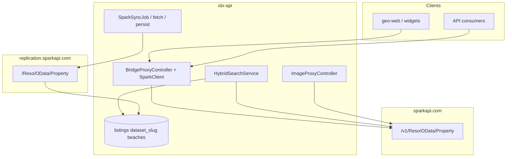

# Spark / BeachesMLS — idx-api integration

How Quantyra **idx-api** mirrors and proxies BeachesMLS data via the Spark Platform RESO OData API.

**Compliance:** [spark-compliance.md](spark-compliance.md)  
**RESO paths & queries:** [reso-api-reference.md](reso-api-reference.md)  
**Platform context:** [platform-overview.md](platform-overview.md)

---

## Architecture



| Path | Upstream host |
|------|----------------|
| User-facing RESO proxy, live search, images | `sparkapi.com` |
| Scheduled mirror sync | `replication.sparkapi.com` |

---

## Credentials

Server-side only (`.env`, never committed):

| Variable | Purpose |
|----------|---------|
| `SPARK_ACCESS_TOKEN` | Bearer for all Spark HTTP |
| `SPARK_API_FEED_ID` | Spark dashboard API Feed ID (logging/audit) |

Legacy: `SPARK_API_KEY` aliases to `SPARK_ACCESS_TOKEN` in `config/spark.php`.

---

## API hosts

Configured in [`config/spark.php`](../../config/spark.php):

| Config key | Default | Used by |
|------------|---------|---------|
| `replication_reso_base_url` | `https://replication.sparkapi.com/Reso/OData` | `SparkSyncService`, fetch jobs |
| `live_reso_base_url` | `https://sparkapi.com/v1/Reso/OData` | `SparkClient`, `SparkSearchClient`, image proxy |

| Env variable | Role |
|--------------|------|
| `SPARK_REPLICATION_HOST` | Replication host (default `https://replication.sparkapi.com`) |
| `SPARK_REPLICATION_RESO_ROOT` | Path segment (default `Reso/OData`) |
| `SPARK_API_HOST` | Live host (default `https://sparkapi.com`) |
| `SPARK_API_VERSION` | Version prefix (default `v1`) |
| `SPARK_LIVE_RESO_ROOT` | Live RESO path (default `Reso/OData`; try `Version/3/Reso/OData` if metadata 404) |
| `SPARK_RESO_BASE_URL` | Legacy override for **replication** base only |

### Smoke tests

```bash
# Replication (workers)
curl -sS -H "Authorization: Bearer $SPARK_ACCESS_TOKEN" -H "Accept: application/json" \
  "${SPARK_REPLICATION_HOST:-https://replication.sparkapi.com}/${SPARK_REPLICATION_RESO_ROOT:-Reso/OData}/\$metadata" | head

# Live (proxy)
curl -sS -H "Authorization: Bearer $SPARK_ACCESS_TOKEN" -H "Accept: application/json" \
  "https://sparkapi.com/v1/Reso/OData/\$metadata" | head
```

---

## Catalog and mirror

| Catalog key (`?dataset=`) | `listings.dataset_slug` | Resolver |
|---------------------------|-------------------------|----------|
| `spark_beaches` | `beaches` | `MlsFeedResolver` |
| `beaches` (wire alias) | `beaches` | Normalized to `spark_beaches` |

Bridge feeds remain `bridge_{dataset}` (e.g. `bridge_stellar` → `stellar`).

Domains enable feeds via **Allowed MLS datasets** on the dashboard (`domains.allowed_mls_datasets`). Label shown: **Beaches MLS (Spark)**.

---

## Replication pipeline

**Schedule:** `spark-listings-replica-sync` every 15 minutes → `SparkSyncJob` on queue `spark-sync-fetch`.

**Scope:** Active and Pending only:

```odata
StandardStatus eq 'Active' or StandardStatus eq 'Pending'
```

**Query shape:**

- `$top` ≤ 1000 (`SPARK_SYNC_REPLICATION_TOP`)
- `$expand=Media,Unit,Room,OpenHouse` (`SPARK_SYNC_EXPAND`)
- No `$select` on replication pages
- Incremental: `ModificationTimestamp gt {cursor} and ModificationTimestamp lt {window_end}`; upper bound in `listing_sync_cursors.incremental_window_end`
- Pagination: `@odata.nextLink` → `listing_sync_cursors.replication_next_url` (follow absolute URL; do not rewrite host)

**Staging:** gzip JSON in `bridge_replica_pages` with `provider = spark`.

**Persist:** `ListingMirrorWriter` with `ListingMirrorProvider::Spark` — full row in `raw_data`; indexed columns from standard RESO fields; Beaches encoded fields in `custom_fields`.

**Purge:** `bridge:purge-replica-pages` (shared table; Spark retention via `SPARK_REPLICA_PAGE_RETENTION_HOURS`).

### Key code

| Component | Location |
|-----------|----------|
| Sync orchestration | `app/Services/Spark/SparkSyncService.php` |
| HTTP (replication URLs) | `app/Services/Spark/SparkHttpService.php` |
| Fetch job | `app/Jobs/SparkSyncFetchPageJob.php` |
| Persist jobs | `SparkPersistReplicaChunkJob`, `SparkPersistReplicaFinalizeJob` |
| Feed resolution | `app/Services/Mls/MlsFeedResolver.php` |

---

## Live API proxy

When `MlsFeedResolver` resolves `spark_beaches`, `BridgeProxyController` uses `SparkClient` (live host):

- RESO Property, Member, Office, OpenHouse, Lookup
- Same auth as Bridge: domain slug and/or Sanctum token with MLS allowlist
- JSON passthrough including `DisplayCompliance` (do not strip)

**Hybrid search** (`HybridSearchService`):

- Active/Pending + geo → Postgres mirror (`beaches`)
- Closed / live fallback → `SparkSearchClient` on live host

**Images** (`ImageProxyController`):

- Resolves `MediaURL` via live `Property('ListingKey')?$expand=Media`
- Rewrites CDN URLs in JSON via `BridgeImageUrlRewriter` + `spark.image_rewrite_hosts` (e.g. `cdn.photos.sparkplatform.com`)

---

## Queues and deployment

```env
WORKER_QUEUES=default,bridge-sync-fetch,bridge-sync-persist,spark-sync-fetch,spark-sync-persist
```

Workers and web containers need outbound HTTPS to **both** `replication.sparkapi.com` and `sparkapi.com`.

See [../coolify-deployment.md](../coolify-deployment.md) and [../deployment-operations.md](../deployment-operations.md).

---

## Stats and operations

| Endpoint | Description |
|----------|-------------|
| `GET /api/v1/bridge/stats` | Per-feed stats; Spark mirror uses slug `beaches`, includes `incremental_window_end` |

**Artisan:**

| Command | Purpose |
|---------|---------|
| `php artisan schedule:list` | Confirm `spark-listings-replica-sync` |
| `php artisan bridge:purge-replica-pages` | Purge old staging pages (Bridge + Spark) |

---

## Environment reference

See [`.env.example`](../../.env.example) Spark section and [../../AGENTS.md](../../AGENTS.md) Spark MLS table.

Common tunables: `SPARK_SYNC_REPLICATION_TOP`, `SPARK_SYNC_INCREMENTAL_POLL_MINUTES`, `SPARK_SYNC_PERSIST_JOB_CHUNK`, `SPARK_SYNC_MAX_REQUESTS_PER_SECOND`.

---

## Out of scope (v1)

Documented in [spark-compliance.md](spark-compliance.md); not implemented yet:

- System Info `DisplayCompliance` cache service
- Accounts replication for agent/office attribution
- Automatic compliance field enforcement in proxy responses
