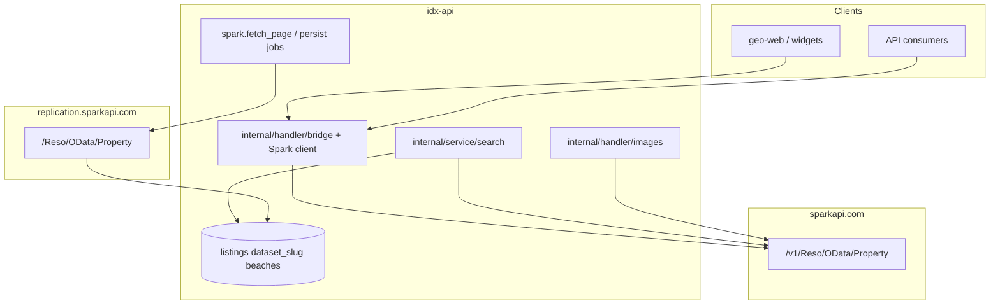

# Spark / BeachesMLS — idx-api integration

How Quantyra **idx-api** mirrors and proxies BeachesMLS data via the Spark Platform RESO OData API.

**Compliance:** [spark-compliance.md](spark-compliance.md)  
**RESO paths & queries:** [reso-api-reference.md](reso-api-reference.md)  
**Platform context:** [platform-overview.md](platform-overview.md)

---

## Architecture



| Path | Upstream host |
|------|----------------|
| User-facing RESO proxy, live search, images | `sparkapi.com` |
| Scheduled mirror sync | `replication.sparkapi.com` |

---

## Credentials

Server-side only (`.env`, never committed):

| Variable | Purpose |
|----------|---------|
| `SPARK_ACCESS_TOKEN` | Bearer for all Spark HTTP |
| `SPARK_API_FEED_ID` | Spark dashboard API Feed ID (logging/audit) |

Configured in [`internal/config/config.go`](../../internal/config/config.go) (`SparkConfig`):

| Setting | Default | Used by |
|---------|---------|---------|
| Replication base | `SPARK_REPLICATION_HOST` + `SPARK_REPLICATION_RESO_ROOT` | `internal/service/sync` Spark worker |
| Live RESO base | `SPARK_API_HOST` + `SPARK_API_VERSION` + `SPARK_LIVE_RESO_ROOT` | Bridge handler, live search, images |

| Env variable | Role |
|--------------|------|
| `SPARK_REPLICATION_HOST` | Replication host (default `https://replication.sparkapi.com`) |
| `SPARK_REPLICATION_RESO_ROOT` | Path segment (default `Reso/OData`) |
| `SPARK_API_HOST` | Live host (default `https://sparkapi.com`) |
| `SPARK_API_VERSION` | Version prefix (default `v1`) |
| `SPARK_LIVE_RESO_ROOT` | Live RESO path (default `Reso/OData`; try `Version/3/Reso/OData` if metadata 404) |
| `SPARK_RESO_BASE_URL` | Legacy override for **replication** base only |

### Smoke tests

```bash
# Replication (workers)
curl -sS -H "Authorization: Bearer $SPARK_ACCESS_TOKEN" -H "Accept: application/json" \
  "${SPARK_REPLICATION_HOST:-https://replication.sparkapi.com}/${SPARK_REPLICATION_RESO_ROOT:-Reso/OData}/\$metadata" | head

# Live (proxy)
curl -sS -H "Authorization: Bearer $SPARK_ACCESS_TOKEN" -H "Accept: application/json" \
  "https://sparkapi.com/v1/Reso/OData/\$metadata" | head
```

---

## Catalog and mirror

| Catalog key (`?dataset=`) | `listings.dataset_slug` | Resolver |
|---------------------------|-------------------------|----------|
| `spark_beaches` | `beaches` | `internal/service/mls` feed resolver |
| `beaches` (wire alias) | `beaches` | Normalized to `spark_beaches` |

Bridge feeds remain `bridge_{dataset}` (e.g. `bridge_stellar` → `stellar`).

Domains enable feeds via **Allowed MLS datasets** during domain registration on the Setup panel, or by editing verified domain cards (`domains.allowed_mls_datasets`). Label shown: **Beaches MLS (Spark)**.

### Normalized mirror columns (persist + replication updates)

| `listings` column | Beaches RESO source | Notes |
|-------------------|---------------------|--------|
| `flood_zone_code` | `Location_sp_and_sp_Legal_co_Flood_sp_Zone2` | Raw MLS flood zone string |
| `low_risk_flood_zone_yn` | Derived from `flood_zone_code` | `true` when code contains X/X500/`no` (case-insensitive) and not A/V; `false` when empty or contains A or V (substring) |
| `estimated_total_monthly_fees` | `AssociationFee` + `AssociationFeeFrequency`, `AssociationFee2` + `AssociationFee2Frequency` | Each fee converted to a monthly equivalent and summed; replaces RESO `total_monthly_fees` / extension fields at persist |

**Association fee frequencies** (exact MLS strings): `Monthly`, `Annually`, `Semi-Annually`, `Quarterly`, `Weekly`, `Daily`, `One Time`. Null frequency or `One Time` does not contribute to the monthly total. If both association pairs yield no recurring total, fallback: `Financial_sp_Information_co_Estimated_sp_Monthly_sp_Assoc_sp_Recurring_sp_Fee3`.

**Conversion:** Monthly = fee; Annually = fee÷12; Semi-Annually = fee÷6; Quarterly = fee÷3; Weekly = fee×52÷12; Daily = fee×365÷12.

Stellar (Bridge) uses `{DATASET}_TotalMonthlyFees` when present, else the same association-fee math. Implemented in `ListingMirrorWriter` + `ListingResoFieldResolver` on every replication upsert.

---

## Live proxy cache (on-demand)

**Schedule:** `mls.proxy_cache_purge` every 15 minutes purges expired **`mls_search_cache`** rows (does not pre-warm Active/Pending).

**Mirror:** Active/Pending replication uses **`spark.replication.sparkapi.com`** into PostGIS **`listings`** (`dataset_slug = beaches`). **`POST /api/v1/search`** serves Active/Pending from the mirror.

**Live cache:** Identical upstream proxy/search requests are gzip-stored in **`mls_search_cache`** (e.g. Closed status, RESO `Property`, web listings with filters). TTL: **`LISTINGS_CACHE_TTL`** (default 15 min).

---

## Replication pipeline

**Schedule:** replication kickoff via scheduler → `spark.fetch_page` jobs on queue **`spark-sync-fetch`** (env `SPARK_SYNC_FETCH_QUEUE`).

**Scope:** Active and Pending only:

```odata
StandardStatus eq 'Active' or StandardStatus eq 'Pending'
```

**Query shape:**

- `$top` ≤ 1000 (`SPARK_SYNC_REPLICATION_TOP`)
- `$expand=Media,Unit,Room,OpenHouse` (`MLS_SYNC_EXPAND` / `SPARK_SYNC_EXPAND`)
- No `$select` on replication pages
- Incremental: `ModificationTimestamp gt {cursor} and ModificationTimestamp lt {window_end}`; upper bound in `listing_sync_cursors.incremental_window_end`
- Pagination: `@odata.nextLink` → `listing_sync_cursors.replication_next_url` (follow absolute URL; do not rewrite host)

**Staging:** gzip JSON in `replica_pages` with `provider = spark` (multi-part payload when rows exceed persist chunk size).

**Persist:** `ListingMirrorWriter` with Spark provider — see [Listings mirror](../listings-mirror.md). **`MLS_SYNC_EXPAND`** collections land in `media`, `unit`, `room`, `open_house` JSONB (stripped from `raw_data`). Overflow keys in `custom_fields`. Canonical **`modification_timestamp`** from `ModificationTimestamp`; cursor **`last_modification_timestamp`**. Fixture: [beaches_50_listings.json](beaches_50_listings.json).

**Bridge (Stellar)** uses different OData expand names (`OpenHouses`, `Rooms`, `UnitTypes`) and omits `$expand` when `BRIDGE_SYNC_FULL_PROPERTY=true` — same JSONB column layout after persist.

**Purge:** queue job **`mls.purge_replica_pages`** (shared `replica_pages` table; retention via `MLS_REPLICA_PAGE_RETENTION_HOURS` / `SPARK_REPLICA_PAGE_*`).

### Key code (Go)

| Component | Location |
|-----------|----------|
| Sync orchestration | `internal/service/sync` (`SparkWorker`, kickoff) |
| Queue handlers | `internal/job/registry.go` (`spark.fetch_page`, `spark.persist_chunk`, …) |
| MLS proxy | `internal/handler/bridge` |
| Feed resolution | `internal/service/mls/feed.go` |

---

## Live API proxy

When the feed resolver selects `spark_beaches`, the bridge handler uses the **live** Spark host:

- RESO Property, Member, Office, OpenHouse, Lookup
- Same auth as Bridge: domain slug and/or Bearer PAT (`idx:access` / `idx:full`) with MLS allowlist
- JSON passthrough including `DisplayCompliance` (do not strip)

**Hybrid search** (`internal/service/search`):

- Active/Pending + geo → Postgres mirror (`beaches`)
- Closed / live fallback → `SparkSearchClient` on live host

**Images** (`internal/handler/images`):

- Resolves `MediaURL` via live `Property('ListingKey')?$expand=Media`
- Rewrites CDN URLs in JSON via `internal/mlspoxy/images.Rewriter` + `BRIDGE_IMAGE_REWRITE_HOSTS` (e.g. `cdn.photos.sparkplatform.com`)

---

## Queues and deployment

```env
WORKER_QUEUES=default,bridge-sync-fetch,bridge-sync-persist,spark-sync-fetch,spark-sync-persist
```

Workers and web containers need outbound HTTPS to **both** `replication.sparkapi.com` and `sparkapi.com`.

See [../coolify-deployment.md](../coolify-deployment.md) and [../deployment-operations.md](../deployment-operations.md).

---

## Stats and operations

| Endpoint | Description |
|----------|-------------|
| `GET /api/v1/bridge/stats` | Per-feed stats; Spark mirror uses slug `beaches`, includes `incremental_window_end` |

**Local ops:**

| Command | Purpose |
|---------|---------|
| `make run-scheduler` | Enqueues `mls.replication_kickoff`, `mls.proxy_cache_purge`, `gis.probe_sources`, purges |
| `make run-worker` | Runs `spark.fetch_page`, `spark.persist_chunk`, `mls.purge_replica_pages`, etc. |

Multi-DC: two schedulers require PostgreSQL advisory lock — [Coolify §7](../coolify-deployment.md#7-scheduler-cluster-leadership-required-for-2-schedulers).

---

## Environment reference

See [`.env.example`](../../.env.example) Spark section and [../../AGENTS.md](../../AGENTS.md) Spark MLS table.

Common tunables: `SPARK_SYNC_REPLICATION_TOP`, `SPARK_SYNC_INCREMENTAL_POLL_MINUTES`, `SPARK_SYNC_PERSIST_JOB_CHUNK`, `SPARK_SYNC_MAX_REQUESTS_PER_SECOND`.

---

## Out of scope (v1)

Documented in [spark-compliance.md](spark-compliance.md); not implemented yet:

- System Info `DisplayCompliance` cache service
- Accounts replication for agent/office attribution
- Automatic compliance field enforcement in proxy responses
