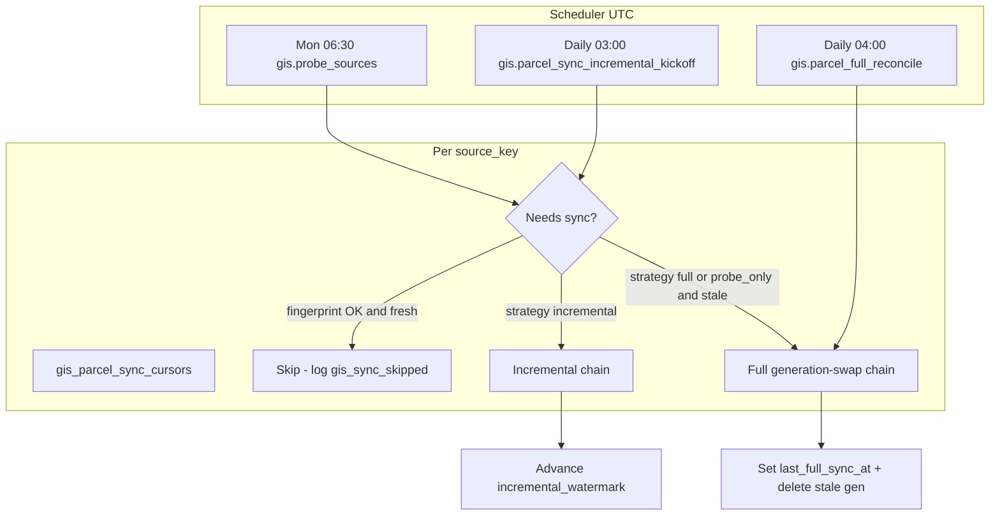

# GIS Incremental Parcel Sync — Design Spec

**Status:** Approved for implementation planning  
**Date:** 2026-05-29  
**Scope:** All 22 MLS pilot counties (Stellar + Beaches)  
**Authors:** Design review (brainstorming session)

---

## 1. Problem Statement

The idx-api GIS parcel pipeline today performs a **full generation-swap sync** on a fixed schedule:

1. Kickoff bumps `gis_source_states.generation`.
2. Worker paginates **every feature** from each ArcGIS source (`resultOffset` / `resultRecordCount`).
3. Rows upsert into `gis_parcels` with the new generation.
4. On the final page, `DeleteStaleParcels` removes rows where `source_generation < currentGen`.

At 22-county scale this implies **500k+ parcel features per monthly cycle**, which is:

- Expensive in ArcGIS API volume and wall-clock time (24–48h initial load documented in deployment guides).
- Redundant when most parcels are unchanged between county assessor updates.
- Misaligned with a **30-day freshness SLA** (monitoring currently uses a hardcoded 35-day parcel threshold).

Only **one county** (Hillsborough) is active in the default kickoff today; the 22 endpoints are documented in `scripts/probe-county-parcels.py` and bboxes exist in `internal/service/gis/parcel_sources.go`, but are not wired for background sync.

**Goal:** Replace the monolithic monthly full download with **incremental watermark sync** where upstream layers support it, **probe-gated skip** when upstream is unchanged, and **rolling full reconcile** for deletion catch-up — across all 22 counties.

---

## 2. Current State (Reference)

| Component | Location | Behavior |
|-----------|----------|----------|
| Full parcel sync | `internal/service/gis/sync_parcels.go` | Generation bump + paginated fetch + delete stale |
| ArcGIS client | `internal/service/gis/arcgis_client.go` | `bbox`, `paginate` modes; `where_filter` falls through to bbox |
| Metadata probe | `internal/service/gis/metadata.go` | Weekly fingerprint; bumps generation on change |
| Scheduler | `internal/scheduler/scheduler.go` | Monthly parcel refresh (1st 02:00 UTC), weekly probe (Mon 06:30) |
| Upsert key | `gis_parcels` | `UNIQUE(parcel_id, source_key)` |
| MLS incremental pattern | `internal/service/sync/cursor.go` | `last_modification_timestamp` + `incremental_window_end` |

**Not implemented:** per-source edit-date WHERE queries, incremental job type, cursor table, 22-county catalog seed, configurable stale thresholds.

---

## 3. Requirements

### Functional

1. **F1:** Support incremental sync for sources where ArcGIS exposes a reliable edit timestamp field.
2. **F2:** Support full generation-swap reconcile for sources without edit fields and for periodic deletion catch-up.
3. **F3:** Skip scheduled sync when weekly probe fingerprint is unchanged **and** data is within freshness SLA.
4. **F4:** Wire all **22 MLS pilot counties** with verified sync strategy per source.
5. **F5:** Treat data as **healthy (not stale)** while within `sync_interval_days` (default **30**) of last incremental or full sync.
6. **F6:** Self-heal on bad incremental queries (fallback to full reconcile, MLS-style window reset).

### Non-Functional

1. **NF1:** Routine incremental runs should target **<5%** of full county feature count on a typical week (Tier-1 sources).
2. **NF2:** No single scheduler event downloads all 500k+ parcels (eliminate monthly monolith).
3. **NF3:** Multi-DC safe: job dedup via existing `HasActiveParcelSyncJob`; PostgreSQL queue only.
4. **NF4:** Read-only discovery script must not mutate production data.

### Out of Scope (v1)

- FDOT boundary layer incremental sync (low volume, annual schedule sufficient).
- Real-time/sub-hourly parcel updates.
- Automatic tombstone detection without full reconcile.
- FDOR statewide cadastral layer (documented broken; remain disabled).

---

## 4. Approaches Considered

| Approach | Summary | Verdict |
|----------|---------|---------|
| **A. Probe-gated full only** | Skip sync when metadata unchanged; full download when triggered | Insufficient — still 500k when triggered |
| **B. Rotating full sync** | One county/day, spread load | Does not reduce total bytes; acceptable fallback only |
| **C. Hybrid incremental + rolling reconcile** | Watermark WHERE + probe gate + daily full for one source | **Selected** |

---

## 5. Architecture

### 5.1 High-Level Flow



### 5.2 Sync Strategies (per `gis_parcel_sources.sync_strategy`)

| Strategy | ArcGIS query | Generation bump | Delete stale rows | Typical counties |
|----------|--------------|-----------------|-------------------|------------------|
| `incremental` | `WHERE edit_field >= watermark` (+ base filter) | No | No | TBD after discovery |
| `full` | Full bbox / paginate / where_filter | Yes | Yes | No edit field |
| `probe_only` | Full when probe fingerprint changed | Yes | Yes | Unstable metadata |
| `shapefile` | Upload ingest job | Yes | Yes | Osceola (until REST viable) |

### 5.3 Probe Gate Logic

Before enqueueing incremental or full sync on scheduled kickoff:

```
needs_sync =
  fingerprint_changed_since_last_check
  OR last_incremental_at IS NULL
  OR last_incremental_at older than sync_interval_days
  OR (sync_strategy = full AND last_full_sync_at older than full_reconcile_interval_days)

if NOT needs_sync:
  skip (increment metrics: gis_sync_skipped_unchanged_total)
```

**Change from today:** `MetadataService.probeOne` must **not** bump `gis_source_states.generation` on fingerprint change alone. Generation bump is reserved for **full reconcile kickoff**. Fingerprint change sets a flag (`upstream_changed_at`) used by the gate.

### 5.4 Rolling Full Reconcile

- Scheduler enqueues **exactly one** full reconcile source per day (round-robin by `last_full_sync_at ASC NULLS FIRST`).
- Completes full 22-county generation-swap cycle every **~22 days**.
- Default `full_reconcile_interval_days = 90` is a **maximum**; daily rotation ensures more frequent deletion catch-up unless overridden.
- Manual admin **Sync (force)** always runs full reconcile for that source.

### 5.5 Incremental Watermark Semantics

Mirror MLS cursor behavior:

- Store `incremental_watermark` as `TIMESTAMPTZ` (normalized from source field).
- On each successful incremental finalize: `watermark = MAX(parsed edit field in batch)`.
- Apply **5-minute overlap** when building WHERE clause: query `field >= (watermark - 5 minutes)` to avoid missing edge updates.
- Optional `incremental_window_end` for self-heal when ArcGIS returns errors on open-ended ranges (same pattern as `listing_sync_cursors.incremental_window_end`).

---

## 6. Data Model

### 6.1 Migration `00011_gis_incremental_sync.sql`

**Alter `gis_parcel_sources`:**

| Column | Type | Default | Notes |
|--------|------|---------|-------|
| `sync_strategy` | TEXT | `'full'` | CHECK IN (`incremental`, `full`, `probe_only`, `shapefile`) |
| `incremental_field` | TEXT | NULL | ArcGIS field name |
| `incremental_field_type` | TEXT | NULL | CHECK IN (`epoch_ms`, `date`, `datetime`) |
| `sync_interval_days` | INT | 30 | Freshness SLA |
| `full_reconcile_interval_days` | INT | 90 | Max days without generation-swap |

**New table `gis_parcel_sync_cursors`:**

```sql
CREATE TABLE gis_parcel_sync_cursors (
    source_key              TEXT PRIMARY KEY REFERENCES gis_parcel_sources(source_key) ON DELETE CASCADE,
    incremental_watermark   TIMESTAMPTZ NULL,
    incremental_window_end  TIMESTAMPTZ NULL,
    last_incremental_at     TIMESTAMPTZ NULL,
    last_full_sync_at       TIMESTAMPTZ NULL,
    last_incremental_rows   BIGINT NOT NULL DEFAULT 0,
    last_full_rows          BIGINT NOT NULL DEFAULT 0,
    consecutive_failures    INT NOT NULL DEFAULT 0,
    capability_verified_at  TIMESTAMPTZ NULL,
    upstream_changed_at     TIMESTAMPTZ NULL,
    created_at              TIMESTAMPTZ NOT NULL DEFAULT NOW(),
    updated_at              TIMESTAMPTZ NOT NULL DEFAULT NOW()
);
```

**Alter `gis_source_states`:**

| Column | Type | Purpose |
|--------|------|---------|
| `upstream_changed_at` | TIMESTAMPTZ NULL | Set when probe fingerprint changes (decoupled from generation bump) |

### 6.2 Monitoring Changes

- Replace hardcoded **35-day** stale cutoff in `internal/repository/gis/monitoring.go` with per-source `sync_interval_days`.
- Stale when: `MAX(last_synced_at) < now - sync_interval_days` **OR** `max_generation != generation` during pending full reconcile.
- Wire `GIS_ORIGIN_MAX_DAYS_COUNTY` into dashboard boundary freshness OR document removal (currently unused in code).

---

## 7. Job Types & Payloads

### 7.1 New Queue Types

| Job type | Queue | Handler |
|----------|-------|---------|
| `gis.parcel_sync_incremental_kickoff` | `GIS_SYNC_QUEUE` | Count eligible sources; enqueue first incremental page per source |
| `gis.parcel_sync_incremental` | `GIS_SYNC_QUEUE` | Fetch one page; chain if more |
| `gis.parcel_full_reconcile_kickoff` | `GIS_SYNC_QUEUE` | Pick one source for daily full reconcile |
| `gis.parcel_sync_page` | (existing) | Unchanged — used for full reconcile pages |

### 7.2 Incremental Page Args

Extends existing `ParcelSyncPageArgs`:

```json
{
  "source_key": "hillsborough_hc_parcels",
  "county": "hillsborough",
  "sync_kind": "incremental",
  "watermark": "2026-05-01T00:00:00Z",
  "window_end": null,
  "offset": 0,
  "generation": 42
}
```

- `sync_kind`: `incremental` | `full`
- Incremental jobs carry current `generation` for upsert stamping but **do not bump** generation at kickoff.
- Full jobs bump generation at kickoff (existing behavior).

### 7.3 Scheduler Cron (proposed)

| Job | Cron (UTC) | Replaces |
|-----|------------|----------|
| `gis.probe_sources` | `0 30 6 * * 1` | (keep) |
| `gis.parcel_sync_incremental_kickoff` | `0 0 3 * * *` | — |
| `gis.parcel_full_reconcile_kickoff` | `0 0 4 * * *` | — |
| `gis.monthly_parcel_refresh` | *(remove)* | Monthly monolith |

---

## 8. ArcGIS Client Changes

### 8.1 `SyncModeWhereFilter`

Dedicated branch in `FetchParcelPage`:

- **No** `geometry` / envelope parameters.
- `where` = `Combine(base ArcGISWhere, incremental WHERE)`.
- Pagination via `resultOffset` / `resultRecordCount`.

Required for SFWMD/SWFWMD sources: `CNTYNAME='Martin' AND LASTUPDATE >= ...`.

### 8.2 `BuildIncrementalWhere`

```go
func BuildIncrementalWhere(
    baseWhere string,
    field string,
    fieldType string, // epoch_ms | date | datetime
    watermark time.Time,
    windowEnd *time.Time,
) string
```

- Apply 5-minute overlap on watermark.
- Format dates per ArcGIS expectations (discovered per source in Phase 0).
- AND-combine with non-empty `baseWhere`.

### 8.3 Edit Field Extraction

New helper in `field_extract.go`:

```go
func ExtractEditTimestamp(props map[string]any, field, fieldType string) (time.Time, bool)
```

Used when advancing watermark after each batch.

---

## 9. Phase 0 — Capability Discovery (Prerequisite)

**Script:** `scripts/discover-gis-incremental-fields.py`

For each of 22 PRIMARY endpoints in `probe-county-parcels.py`:

1. GET layer metadata `?f=json` → fields array, `editingInfo.lastEditDate`.
2. Score candidate fields: `LASTUPDATE`, `LastEditDate`, `MODIFIED`, `EditDate`, `DATESTAMP`, etc.
3. For top candidates, run `returnCountOnly=true`:
   - Full county filter (bbox or arcgis_where).
   - Incremental: `field >= '<30 days ago>'`.
4. Record query latency and HTTP status.
5. Emit:
   - `docs/gis-incremental-capability-matrix.md` (human-readable)
   - `docs/scripts/gis_parcel_sources_seed.json` (machine seed for migration or seed job)

**Classification rules:**

| Tier | Criteria | Assigned strategy |
|------|----------|-------------------|
| 1 | Edit field exists; incremental count query < 10s; returns sane count | `incremental` |
| 2 | No edit field OR incremental query fails/timeouts | `full` + probe gate |
| 3 | Shared regional layer | `where_filter` + per-county `source_key` + strategy from tier 1/2 |
| 4 | Osceola REST gap | `shapefile` |

**Special cases (known):**

- **Orange:** bbox tiles often return 0 — use `paginate` sync mode; test incremental on paginated WHERE.
- **Broward:** slow — `http_timeout_sec = 120`.
- **Pinellas:** prefer SWFWMD L13 over enterprise host.
- **FDOR statewide:** disabled; do not seed.

---

## 10. 22-County Source Catalog

Each county gets a distinct `source_key` (pattern: `{county_slug}_{provider}_parcels`).

Seed from `probe-county-parcels.py` PRIMARY list with:

- `county_slug`, `query_url`, `sync_mode`, `arcgis_where`, bbox, `mls_feed`
- `sync_strategy`, `incremental_field`, `incremental_field_type` from capability matrix
- `http_timeout_sec` where needed (Broward, Pinellas enterprise)

**Regional layers:** duplicate `query_url` with different `source_key` + `arcgis_where` per county (Martin, St Lucie, Okeechobee, Miami-Dade via SFWMD; Charlotte, DeSoto, etc. via SWFWMD).

**Catalog location:** DB-first via migration seed + `EnsureParcelSourceCatalog` on kickoff; keep `ParcelSourceCatalog()` as fallback for Hillsborough/Pinellas code defaults.

---

## 11. Error Handling & Self-Heal

| Condition | Action |
|-----------|--------|
| ArcGIS 400 on incremental WHERE | Clear `incremental_window_end`; enqueue full reconcile; increment `consecutive_failures` |
| Empty incremental + `upstream_changed_at` set | Schedule full reconcile for source |
| `consecutive_failures >= 3` | Force full reconcile; dashboard warning |
| Empty first page on **full** sync | Hard error (existing guard — prevent mass delete) |
| Empty first page on **incremental** | Log info; advance watermark to NOW(); no delete |

Reference: `internal/service/sync/fetch_heal.go` (MLS incremental bad-request self-heal).

---

## 12. Operations & Dashboard

### Admin API (`/api/v1/admin/gis/sources`)

Extend list/detail response:

- `sync_strategy`, `incremental_field`, `sync_interval_days`
- Cursor: `incremental_watermark`, `last_incremental_at`, `last_full_sync_at`, `last_incremental_rows`

### Dashboard GIS tile

- Per-source: strategy badge, watermark age, last run row counts.
- Stale indicator uses `sync_interval_days` (30 default).
- Incident when `consecutive_failures >= 3` or probe unreachable.

### Metrics (Prometheus)

- `gis_incremental_rows_upserted_total{source_key}`
- `gis_sync_skipped_unchanged_total{source_key}`
- `gis_full_reconcile_duration_seconds`

---

## 13. Testing Strategy

| Level | Cases |
|-------|-------|
| Unit | `BuildIncrementalWhere` all field types; `ExtractEditTimestamp`; sync mode routing |
| Unit | Probe gate: skip when fresh + unchanged fingerprint |
| Integration | Mock ArcGIS: incremental chain does not bump generation or delete |
| Integration | Full chain deletes old generation on finalize |
| Integration | Incremental 400 → full fallback enqueued |
| Staging | Discovery script read-only against live endpoints |
| Staging | Hillsborough incremental + one SFWMD county; compare counts |

---

## 14. Implementation Phases

| Phase | Deliverable | Depends on |
|-------|-------------|------------|
| **0** | Discovery script + capability matrix + seed JSON | — |
| **1** | Migration 00011 + cursor repository | Phase 0 |
| **2** | `where_filter` + `BuildIncrementalWhere` + incremental job handlers | Phase 1 |
| **3** | Seed 22 counties from JSON | Phase 0, 1 |
| **4** | Scheduler changes + probe decoupling | Phase 2 |
| **5** | Dashboard + monitoring alignment | Phase 2 |
| **6** | Staging validation + docs update (`gis-sources.md`, `INDEX.md`) | All |

---

## 15. Risks & Mitigations

| Risk | Impact | Mitigation |
|------|--------|------------|
| Edit field not indexed | Slow/timeouts | Discovery benchmarks; downgrade to `full` |
| Inconsistent date formats | Missed updates | Per-source `incremental_field_type`; overlap |
| Deleted parcels linger | Stale map polygons | Daily rolling full reconcile (~22-day cycle) |
| Initial 22-county bootstrap | One-time heavy load | Keep existing full sync for bootstrap only |
| Orange bbox-zero | Empty sync errors | Paginate mode + incremental WHERE |
| Probe fingerprint false positives | Unnecessary sync | Combine with watermark + interval gate |

---

## 16. Success Criteria

- [ ] Monthly `gis.monthly_parcel_refresh` removed from scheduler.
- [ ] All 22 counties have enabled `gis_parcel_sources` rows with verified strategy.
- [ ] Tier-1 counties download **<5%** of full count on typical weekly incremental.
- [ ] Dashboard shows **healthy** for sources synced within **30 days**.
- [ ] Each source completes full generation-swap at least every **~22 days** via rolling reconcile.
- [ ] No production incident from empty-first-page mass delete (guards preserved).

---

## 17. Open Items (Post-Spec)

1. **Capability matrix** — populated by Phase 0 discovery (field names unknown until probed).
2. **Osceola** — confirm shapefile ingest path vs REST stub.
3. **Worker queue topology** — confirm `GIS_SYNC_QUEUE` on worker 1 in both DCs (`temp/idx-api-worker-1.txt` env).

---

## 18. References

- Plan: `.cursor/plans/gis_incremental_sync_c091fc1d.plan.md`
- Existing docs: `docs/gis-sources.md`, `docs/gis-api.md`, `docs/INDEX.md`
- MLS cursor pattern: `internal/service/sync/cursor.go`
- County endpoints: `scripts/probe-county-parcels.py`
